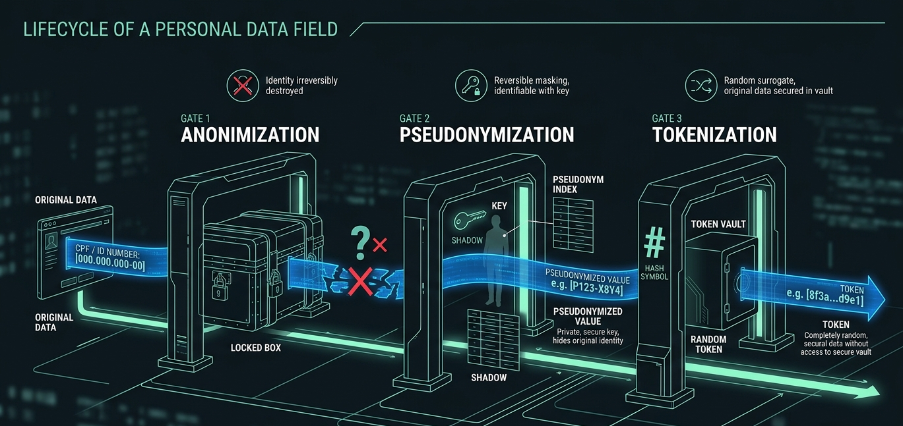

Most data teams treat privacy law as something to solve "later".

First the pipeline gets built, the data lands in the lake, the dashboards start shipping. Then one day a data subject request shows up asking for deletion of personal data. And the team finds out it doesn't know where that ID lives, how many copies sit in Bronze, how many ML models were trained on it.

That's too late.

LGPD (Brazil's data privacy law, similar in spirit to GDPR) isn't compliance at the end of the pipeline. It's a design constraint that starts at the first byte you ingest. There are four principles that, if you build them into the ingestion layer, prevent almost every downstream pain.

## Principle 1: minimize at the source, not at the destination

Art. 6, III of LGPD requires **necessity**: only process data that is adequate and limited to the purpose.

The practical translation is simple. Don't ingest what you won't use.

Sounds obvious, but it isn't. Most pipelines ingest entire tables (including IDs, phone numbers, addresses, emails) "because it's in the source". Then compliance shows up, asks for the mapping of these fields, and discovers 80% of them were never consumed by anyone.

The right pattern is to apply schema filtering before persistence. In the ingestion pipeline, you explicitly define which fields enter the lake. Whatever doesn't enter never becomes your retention problem, anonymization problem, audit problem.

The question worth asking before each field is: *what concrete use case needs this data?*. If the answer is "I dunno, could be useful", then it isn't needed.

## Principle 2: pseudonymize from the first byte

Three terms that look alike and aren't.

**Anonymization** is data made irreversible. Nobody can be identified anymore. It's the only state LGPD treats as out of scope (Art. 12).

**Pseudonymization** is identity replaced by a code, but reversible via a separate mapping table. Still personal data (Art. 13, §4). Reduces risk, but doesn't remove the obligation.

**Tokenization** is a specific pseudonymization pattern with deterministic tokens, useful for preserving joins without exposing the original data.

The pattern that works is to tokenize at ingestion. Bronze never sees raw data. It sees the deterministic token. The `token ↔ original` mapping lives in an isolated table, with encryption at rest, audited access, and its own retention policy.

This solves three problems at once. You can join tables in the lake without exposing the original data. Right to erasure becomes a `DELETE` in the mapping, no need to touch Bronze. And analysts and ML models work with pseudonymized data by default, reducing the risk surface.

## Principle 3: lineage is a requirement, not a feature

When a data subject request shows up (Art. 18, right of access, correction, deletion), you have 15 days to respond. Without complete lineage, that deadline becomes a nightmare.

Real lineage answers three questions for any personal data. Where did it come from? Source system, original field, ingestion timestamp. What transformations did it go through? Pipeline steps, applied rules, derivations. Where is it now? Tables, trained models, dashboards that consume it.

Tools like OpenLineage, DataHub and Databricks Unity Catalog deliver this, but only if you instrument from ingestion onward. Adding lineage after the pipeline is already running is ten times more expensive than adding it before.

The practical test is direct: can you, in under an hour, list every table and model that contains the ID `123.456.789-00`? If you can't, your lineage isn't LGPD-ready.

## Principle 4: retention by purpose, not by table

Art. 15 says processing ends when the purpose is fulfilled. Art. 16 completes: after that, data must be deleted.

In data engineering practice, this means each piece of data has its own clock. You can't define a single "retention equals 5 years" policy for all tables. Some purposes require months, others years, others are indefinite (under different legal bases).

Patterns that work: tables partitioned by processing date, with `VACUUM` or `TRUNCATE PARTITION` at the end of the cycle. A purpose map documented in code, a YAML that defines, per table and per field, which purpose justifies it, which legal basis, which deadline. And automated expiration jobs, no relying on manual process: configure retention policies that run themselves.

Delta Lake, BigQuery and Snowflake all have mechanisms for this. The real work is translating legal purpose into technical configuration, and that's the work nobody wants to do, but it determines whether you clash with the regulator or not.

## What data engineers need to align with legal

Three conversations engineering can't outsource.

The first is the legal basis of each data. Consent? Legitimate interest? Contract execution? Each has different technical implications. Right to revoke, for example, only exists under consent.

The second is the concrete purpose of each pipeline. "Analytics" doesn't count. Which business decision does this data support?

The third is the response process for subject requests. Who receives? What's the flow? What's the internal SLA? This must be documented, tested, and have an owner.

If these three conversations haven't happened yet, your personal-data pipeline is running on compliance debt.

## What stays

LGPD isn't a checklist at the end. It's a design constraint that changes four things. What you ingest (minimization). How you ingest (pseudonymization). What you track (lineage). How long you keep (retention by purpose).

Teams that treat it as "we'll solve it later" pay the entire tech debt on the first subject request that arrives. Teams that treat it as a design constraint from the first byte don't even notice it's there, because it's just how things work.

The difference between the two isn't legal. It's engineering.

What's the trickiest data subject request your team has ever dealt with? Reply on [LinkedIn](https://linkedin.com/in/thacvaz) or subscribe to the [Substack](https://vazdeng.substack.com) for the next posts.
