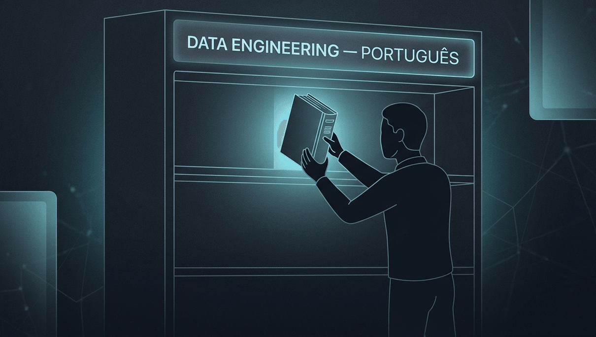

Conteúdo de engenharia de dados em português, daquele tipo que você abre e sente que a pessoa viveu o que está escrevendo, é raro de achar.

Procura agora. Você vai encontrar muito material de qualidade pra começar: traduções de artigos gringos, tutoriais que partem da documentação oficial, cursos de Pandas com datasets simples. Tudo isso tem espaço, é por onde a maioria das pessoas começa, e quem produz esse material está fazendo um trabalho importante.

O que ainda é difícil de achar é alguém te contando como decidiu usar Delta Lake em vez de Parquet num ambiente que processa centenas de milhões de transações por dia. Ou em quais momentos a Medallion Architecture ajuda e em quais ela só atrapalha. Ou como a LGPD muda, na prática, a forma como você desenha uma camada de ingestão.

É esse pedaço que eu quero ajudar a preencher.

## Quem sou eu pra dizer isso

Não vou listar certificados. Vou te contar o que construí.

Comecei no Itaú, onde ganhei o Prêmio Mérito por trabalho em qualidade de dados. Passei pela EBANX quando ela ainda era uma fintech em crescimento e construí pipelines ETL que processavam mais de 100 milhões de transações por dia. Liderei uma equipe internacional na HCL Technologies em projetos para a Apple em Silicon Valley, gerenciando mais de 500 milhões de eventos diários. Hoje sou engenheira de dados sênior no Bradesco.

Minha stack principal é Databricks. Não porque eu li um tutorial. Porque é o que roda em produção nos lugares onde trabalhei nos últimos anos.

Em 2024 entrei no mestrado em Métodos Numéricos em Engenharia na UFPR. Minha pesquisa é sobre monitoramento preditivo baseado em IA usando LLMs pra sistemas operacionais. Tudo que aprendo lá eu pretendo trazer pra cá traduzido pra realidade de quem trabalha com dados todo dia.

## Por que cripto entrou nessa história

Alguns anos atrás eu comecei a estudar análise on-chain. E percebi uma coisa que pouca gente parece estar dizendo de forma clara: cripto, em boa parte, é um problema de engenharia de dados ainda mal resolvido.

Os dados estão todos ali. Na blockchain, abertos, públicos. Mas a maioria das pessoas que investe não sabe tratá-los, e grande parte das engenheiras de dados ainda não está olhando pra eles.

Então decidi construir um agente de IA especialista em cripto. Do zero, em público, documentando cada decisão de arquitetura. Com as mesmas ferramentas que uso no trabalho: pipelines reais, backtesting rigoroso, modelos estatísticos de verdade. Sem hype, sem promessa de enriquecimento rápido.

## O que você vai encontrar aqui

Três frentes, uma newsletter.

A primeira é **engenharia de dados de produção**: Databricks, Delta Lake, Spark, dbt, Airflow. Decisões reais de arquitetura, erros que cometi e o que aprendi com eles, contexto brasileiro onde for relevante (LGPD na prática, custo de cloud, a realidade de dados em instituições financeiras).

A segunda é o **agente de IA pra cripto**, construído em público. Arquitetura, código, backtesting, análise on-chain. Cada etapa documentada. Se der errado, você vai saber por quê.

A terceira é o **mestrado traduzido pra prática**. O que a pesquisa acadêmica tem a dizer sobre os problemas que você enfrenta todo dia. Sem filtro, sem academiquês.

Publicações em português e inglês, toda semana.

Responde esse post com uma pergunta: qual é o maior desafio de dados que você está enfrentando agora? Eu leio tudo.

Thais Vaz

[Newsletter no Substack →](https://vazdeng.substack.com)
