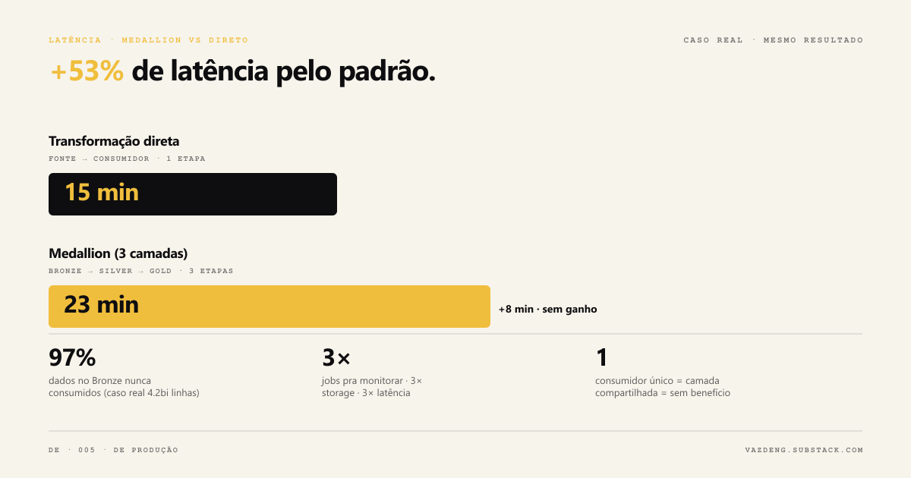
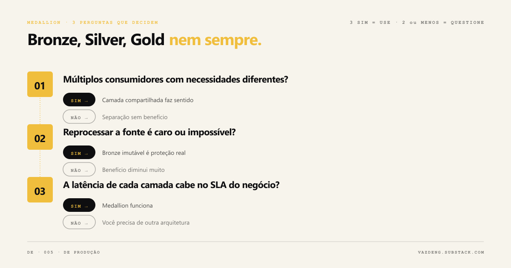

Existe um padrão de arquitetura que vi crescer desde 2020, criado pelo Databricks, adotado pela Microsoft como padrão oficial da plataforma Fabric em 2023, e que hoje está em quase toda conversa sobre engenharia de dados: o Medallion Architecture.

Bronze, Silver, Gold. Dado bruto, dado limpo, dado agregado.

O problema não é o padrão. O problema é que ele virou resposta automática. E quando qualquer arquitetura vira resposta automática, ela começa a criar mais problema do que resolve.

O próprio Databricks deixa isso claro na documentação oficial: *"Following the medallion architecture is a recommended best practice but not a requirement."*

Isso raramente aparece nas apresentações.

## O que é Medallion Architecture, de verdade

O Databricks define assim: um padrão de design que organiza dados em um lakehouse em camadas que *progressivamente melhoram* a estrutura e qualidade do dado, da Bronze para a Silver para a Gold.

**Bronze** guarda o dado exatamente como veio da fonte, sem nenhuma transformação. É o arquivo histórico imutável. Se algo der errado nas camadas seguintes, você volta aqui.

**Silver** aplica o mínimo de transformação necessário para criar uma visão consistente da empresa: limpeza, padronização, deduplicação, joins entre fontes. É onde o dado vira informação confiável.

**Gold** organiza os dados para consumo específico: dashboards de analytics, modelos de ML, relatórios financeiros. É desnormalizada, otimizada para leitura, pensada para o usuário final.

Vale um dado histórico: o conceito de pipeline em camadas não é novo. Data Warehousing dos anos 1990 já usava staging, cleansed e presentation layers. O que o Databricks criou em 2020 foi a terminologia Bronze/Silver/Gold e o branding "Medallion", não o princípio em si. Isso não torna o padrão inválido, só ajuda a entender o que é inovação e o que é nomenclatura.

## Quando Medallion funciona bem

O padrão resolve três problemas reais, e resolve bem.

**Primeiro: reprocessamento sem perda.** Quando um bug aparece na transformação Silver, você volta ao Bronze e reprocessa sem precisar buscar os dados novamente na fonte. Em sistemas onde a fonte só mantém os últimos 90 dias de histórico, essa proteção pode ser a diferença entre corrigir um problema e perder dois anos de dados.

**Segundo: múltiplas equipes com necessidades diferentes.** O time de analytics precisa de totais por mês. O time de ciência de dados precisa do dado no menor grão para treinar o modelo. Os dois compartilham o Silver, cada um constrói sua camada Gold de forma independente. Sem duplicação do trabalho de limpeza, sem inconsistência entre as visões.

**Terceiro: separação de responsabilidade em times grandes.** A equipe de ingestão cuida do Bronze sem precisar conhecer as regras de negócio. A equipe de transformação cuida do Silver sem depender da equipe de ingestão. Em organizações com mais de 20 profissionais de dados trabalhando em paralelo, isso reduz acoplamento e bloqueios.

Quando esses três problemas existem, Medallion é uma escolha sólida. Quando não existem, você está adicionando complexidade sem contrapartida.

## Onde Medallion começa a atrapalhar

### Quando há um único consumidor

Você tem um pipeline que ingere dados de folha de pagamento para alimentar um único dashboard de RH. Uma equipe consome, uma finalidade, uma transformação.

Aplicar Medallion aqui significa criar Bronze, Silver e Gold para servir exatamente a mesma coisa. O dado passa por três camadas de leitura e escrita, três conjuntos de jobs para monitorar, e três vezes a latência. Por zero ganho.

O sinal prático: se a camada Gold é idêntica à Silver com um agrupamento a mais, você não precisa de três layers. Uma única transformação direta da fonte para a tabela consumida faz o mesmo trabalho com metade da infraestrutura.

Um caso documentado por um arquiteto de dados: um cliente tinha 4,2 bilhões de linhas no Bronze acumuladas em seis anos de dados, mas o Silver só consumia os últimos 90 dias. 97% dos dados armazenados nunca eram usados. O custo de storage era real, o benefício não era.

### Quando a latência importa mais do que a qualidade

Cada transição Bronze para Silver, Silver para Gold, é um job separado. Em pipelines com Spark, isso costuma ser 20 a 40 minutos por camada. Três camadas em sequência e a latência total passa de uma hora antes de o dado chegar em qualquer lugar.

Análises com dados reais de praticantes mostram overhead de 53% ou mais em casos simples: 23 minutos com Medallion contra 15 minutos com transformação direta, para o mesmo resultado.

Quando o negócio precisa do dado em 30 minutos para tomar decisão, uma arquitetura com 80 minutos de latência não é um problema de código. É um problema de arquitetura.

Para dados que precisam chegar em tempo real ou próximo disso, o Databricks é explícito: recomenda micro-batch (latência de segundos a poucos minutos) para Medallion, e orienta explicitamente que quando a ingestão vem de um message broker como Kafka, a leitura direta sem etapa intermediária reduz complexidade e latência. Para sub-segundo, a própria documentação aponta limitações no modo real-time que afetam negativamente o throughput.

### Quando é protótipo ou análise de vida curta

Uma exploração rápida de dados. Um modelo que vai existir por três meses. Uma análise pontual que vai virar um número num slide e não será consumida de novo.

Forçar Medallion num protótipo cria tabelas que nunca serão mantidas, jobs que ninguém vai monitorar, e estrutura que será abandonada em duas semanas. A equipe gasta tempo e energia organizando o que deveria ser descartável.

Protótipo precisa ser rápido de construir e fácil de jogar fora. Três camadas dificultam as duas coisas.

### Quando o time é pequeno e os dados são simples

Uma startup com 3 engenheiros de dados processando 500 GB não tem os mesmos problemas que um banco com 50 engenheiros e 50 TB. O overhead operacional de manter Bronze, Silver e Gold, com todas as tabelas, jobs, documentação e monitoramento que isso exige, pode ser injustificável quando o benefício real é pequeno.

Para times pequenos com um ou dois casos de uso, duas camadas (dado bruto e dado consumível) ou uma solução com dbt direto na fonte resolvem o problema sem a complexidade adicional.

## O anti-padrão que ninguém comenta

Vi um problema específico aparecer mais do que qualquer outro quando Medallion não funciona bem: a Bronze fica exposta como produto de dados.

Elliott Cordo, engenheiro de dados com trabalho publicado sobre arquitetura de dados, documenta isso como anti-padrão direto: expor a camada Bronze para quem consome cria acoplamento forte entre quem usa os dados e os detalhes internos de como eles são armazenados. Quando a fonte muda, todos os consumidores quebram junto.

O segundo problema documentado: quando Silver é Bronze com um campo renomeado, e Gold é Silver com um GROUP BY, as camadas intermediárias não agregam valor real. Analistas acabam escrevendo SQL complexo no Gold ou criando planilhas paralelas para compensar. Múltiplas equipes implementam a mesma métrica de formas diferentes, e os números começam a divergir.

Nesses casos, o padrão não está sendo aplicado, está sendo imitado.

## A pergunta certa antes de decidir

Três perguntas definem se Medallion é a arquitetura certa:

**Há múltiplos consumidores com necessidades diferentes?** Se sim, uma camada compartilhada entre eles faz sentido. Se não, você está criando separação sem benefício.

**Reprocessar os dados na fonte é caro ou impossível?** Se sim, Bronze imutável é proteção real. Se você consegue reprocessar sem custo ou perda de histórico, o benefício diminui.

**A latência de cada camada cabe no prazo que o negócio exige?** Se sim, Medallion funciona. Se não, você precisa de uma arquitetura diferente para esse caso de uso.

Três "sim": Medallion é uma escolha sólida. Dois ou menos: vale questionar quantas camadas você realmente precisa.

## O que empresas grandes usam na prática

Um detalhe importante que raramente aparece nas discussões: Netflix e Uber, duas das empresas mais referenciadas em engenharia de dados, não usam a terminologia Bronze/Silver/Gold.

A Netflix usa o padrão WAP (Write-Audit-Publish) com Apache Iceberg: o dado é escrito em snapshot oculto, auditado automaticamente, publicado se aprovado. O problema que resolve é o mesmo (qualidade antes da exposição), mas a implementação é diferente e não usa as três camadas do Medallion.

O Uber usa um data lake transacional com Apache Hudi, com tabelas raw, derivadas e agregadas. A migração de batch completo para incremental ETL reduziu o tempo de pipeline em 82% e o custo em 78%, segundo o Uber Engineering Blog de março de 2023. Mas esses números são do incremental ETL, não do padrão de camadas em si.

A Microsoft adotou Medallion como arquitetura oficial do Fabric em 2023 e é hoje o maior case público de adoção institucional. Ainda assim, a documentação da própria Microsoft orienta: antes de construir pipelines complexos entre camadas, avalie Materialized Lake Views, que gerenciam as transformações automaticamente sem overhead operacional.

## O que fica

Medallion Architecture é um padrão bom para os problemas certos: times grandes, múltiplos consumidores, dados críticos que precisam de histórico protegido e qualidade progressiva.

Não é obrigatório. Não é universal. E quando aplicado onde não cabe, o custo é real: latência desnecessária, storage desperdiçado, complexidade operacional sem benefício.

A escolha da arquitetura deveria começar pelo problema, não pelo padrão. O que esse pipeline precisa resolver? Quem vai consumir? Qual é o prazo aceitável? Reprocessar da fonte é caro?

Se as respostas apontam para Medallion, ótimo. Se não apontam, uma arquitetura mais simples vai resolver melhor.

Você já implementou Medallion num lugar que não precisava? O que aconteceu depois? Me conta no [LinkedIn](https://linkedin.com/in/thaisvaz) ou assina a [newsletter](https://vazdeng.substack.com) para receber os próximos posts.
