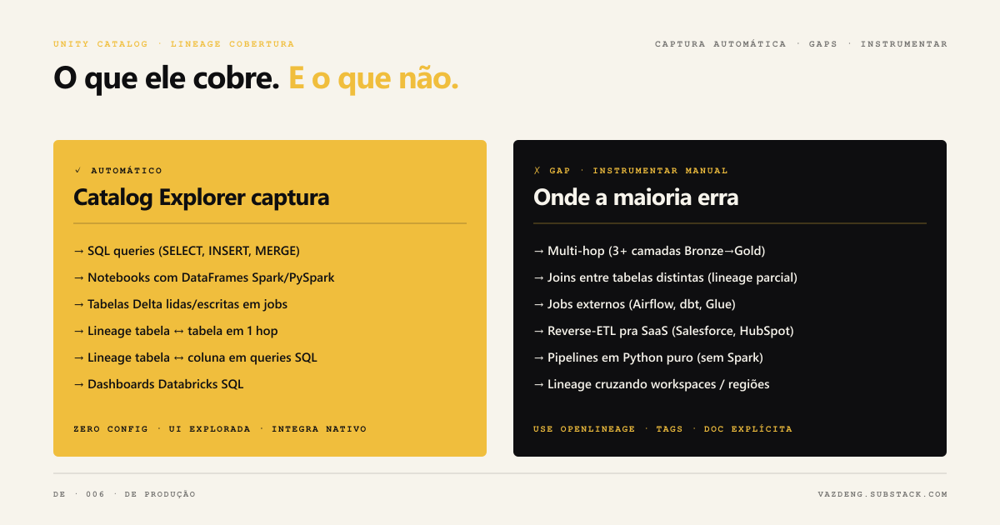

Quando me perguntam "de onde vem esse número?", tenho duas respostas possíveis.

A primeira é abrir o código, rastrear manualmente qual job leu de qual tabela, entender quais transformações foram aplicadas, e voltar até a fonte. Em pipelines com 20 steps isso pode levar horas.

A segunda é abrir o Unity Catalog, clicar na coluna em questão, e ver o grafo completo: fonte, transformações, tabelas intermediárias, destino. Em segundos.

Essa diferença é o que lineage resolve na prática. Mas o Unity Catalog não captura tudo automaticamente. Entender o que ele cobre e o que exige trabalho adicional é o que separa uma implementação que funciona de uma que dá falsa sensação de segurança.

## O que o Unity Catalog captura automaticamente

O Unity Catalog intercepta os planos de execução do Spark em runtime e registra cada leitura e escrita em tabelas do metastore. Não precisa de configuração extra no código.

**Lineage de tabelas** funciona para qualquer operação SELECT, CREATE TABLE AS SELECT, INSERT INTO SELECT em qualquer linguagem: Python, SQL, Scala, R. Para cada operação, o sistema registra qual tabela foi lida, qual foi escrita, em qual job, em qual notebook, com qual usuário, em qual horário.

**Lineage de colunas** vai além: mapeia quais colunas de origem alimentam quais colunas de destino. Requer Databricks Runtime 11.3 LTS ou superior para jobs comuns. Para Delta Live Tables, requer 13.3 LTS ou superior.

Essas informações ficam acessíveis de duas formas: pelo Catalog Explorer com interface visual, e pelos system tables `system.access.table_lineage` e `system.access.column_lineage` para quem precisa programaticamente.



## O que não é capturado e onde a maioria erra

A documentação oficial é clara mas discreta sobre as limitações. Vi essas limitações morderem em produção mais de uma vez.

**UPDATE, DELETE e INSERT VALUES não geram edges de lineage.** Essa é a limitação mais crítica para quem trabalha com CDC, SCD Type 2, ou qualquer pipeline com atualizações in-place. O dado foi modificado, mas o Unity Catalog não registra essa relação.

**MERGE INTO não captura lineage por padrão.** É possível ativar com `spark.databricks.dataLineage.mergeIntoV2Enabled`, mas exige configuração explícita em cada cluster ou job.

**RDDs não são suportados.** A Unity Catalog API não funciona com RDD e portanto qualquer pipeline que use a API de baixo nível do Spark fica completamente fora do rastreamento.

**Objetos renomeados perdem o histórico permanentemente.** Se você renomear uma tabela, um schema ou um catálogo, o lineage histórico quebra. Não existe migração automática do grafo quando o objeto muda de nome.

**JDBC connections fazem bypass completo.** Dados lidos ou escritos via JDBC não passam pelo mecanismo de captura do Unity Catalog.

**Tabelas referenciadas por path (s3://...) não capturam column lineage.** Table lineage via path funciona, mas mapeamento de colunas não.

E um detalhe prático importante: os system tables só têm dados a partir de setembro de 2024. Se você precisa de lineage histórico antes dessa data, não existe nos system tables.

## Multi-hop lineage: o que o Catalog Explorer não mostra

O visualizador do Catalog Explorer exibe apenas um hop em cada direção: uma tabela upstream e uma tabela downstream imediata. Se o dado passou por cinco transformações, você vê só a adjacente.

Para rastrear a cadeia completa, a abordagem é fazer queries iterativas nos system tables:

```sql
-- Encontrar todos os ancestrais de uma tabela (multi-hop)
WITH RECURSIVE lineage AS (
  SELECT source_table_name, target_table_name, 1 as hop
  FROM system.access.table_lineage
  WHERE target_table_name = 'minha_tabela_gold'

  UNION ALL

  SELECT l.source_table_name, tl.target_table_name, lineage.hop + 1
  FROM system.access.table_lineage tl
  JOIN lineage l ON tl.target_table_name = l.source_table_name
)
SELECT * FROM lineage ORDER BY hop;
```

Databricks não suporta CTE recursiva nativa nos system tables. Na prática, isso precisa de lógica iterativa em Python que vai fazendo a query por nível.

## OpenLineage como complemento

Para pipelines que saem do ecossistema Databricks (Airflow orquestrando jobs externos, dbt rodando num warehouse diferente, scripts Python com pandas), o OpenLineage é a alternativa mais usada para unificar lineage cross-platform.

O OpenLineage integra via `OpenLineageSparkListener` e captura lineage de S3, GCS, JDBC, Redshift e BigQuery. A integração existe, mas tem bugs documentados com Databricks Spark 3.4+: payloads gerados às vezes contêm apenas inputs sem outputs, e há incompatibilidades entre a versão do agente Spark 3.3 do OpenLineage e a implementação 3.4.1 do Databricks.

Se OpenLineage é crítico no seu setup, verifique a compatibilidade de versão antes de ir para produção.

## O que instrumentar manualmente

Para ter lineage completo em pipelines reais, essas são as lacunas que precisam de trabalho adicional:

**Ferramentas de BI** (Tableau, Power BI, Looker) precisam de connector explícito ou cadastro manual via External Lineage API, que está em Public Preview. O limite é de 10.000 objetos externos e 100.000 relações por metastore.

**Orchestradores externos** (Airflow, Prefect) precisam de integração via API para que os jobs apareçam no grafo de lineage.

**Pipelines com UPDATE/DELETE extensivos** precisam de logging complementar via `system.query.history` para auditoria, já que o lineage automático não cobre essas operações.

## Por onde começar do zero

Se você está instrumentando lineage pela primeira vez num ambiente Databricks:

Primeiro, confirme que os clusters e jobs estão em workspaces com Unity Catalog habilitado. Sem isso, nenhuma captura automática funciona.

Segundo, valide o Databricks Runtime: 11.3 LTS ou superior para column lineage em jobs comuns. Projetos mais antigos rodando em runtimes abaixo disso não vão ter column lineage mesmo com Unity Catalog ativo.

Terceiro, mapeie quais pipelines usam UPDATE/DELETE/MERGE extensivamente. Para esses, defina desde o início qual será a estratégia de auditoria complementar, seja via `system.query.history` ou via logging explícito no código.

Quarto, crie uma query de validação que roda semanalmente contra os system tables e verifica se tabelas críticas têm lineage registrado. Ausência de lineage em tabela importante é sinal de que algo saiu do scope de captura.

Lineage não é uma feature que se ativa e esquece. Eu uso como prática contínua: a cada pipeline novo, valido o que o Unity Catalog capturou e o que ficou de fora.

Com qual parte do lineage você tem mais dificuldade hoje? Me conta no [LinkedIn](https://linkedin.com/in/thaisvaz) ou assina a [newsletter](https://vazdeng.substack.com).
