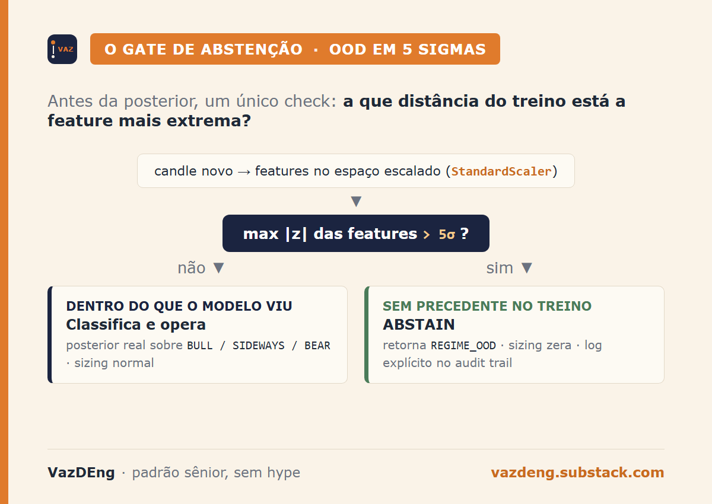
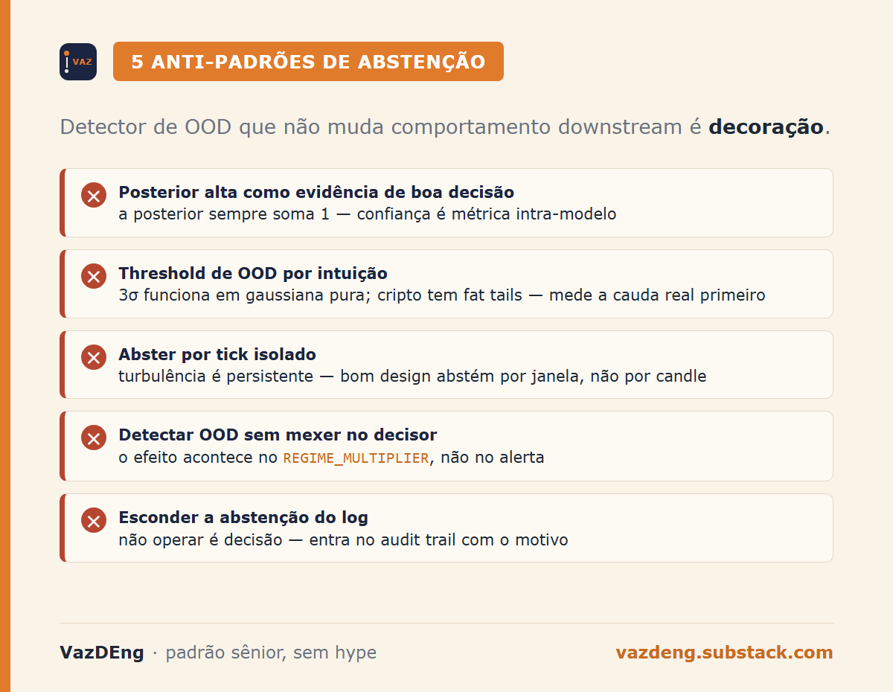

Em setembro de 1998, a Long-Term Capital Management perdeu 4.6 bilhões de dólares em algumas semanas. Os modelos de spread foram treinados em correlações de tempo normal. O default russo e a fuga subsequente para qualidade fizeram correlações que historicamente eram 0.3 convergirem para 1 em dias. Em *When Genius Failed*, o Lowenstein cita o cálculo interno do fundo sobre a probabilidade do que aconteceu:

> *"An event so freakish as to be unlikely to occur even once over the entire life of the universe [...]"*

Os modelos estavam tecnicamente corretos. Estavam só extrapolando confiança numa região do espaço que nunca tinham visto. Não tinham botão de "não sei".

Meu agente quant tinha o mesmo problema, em escala incomparavelmente menor mas com a mesma natureza. Resolvi essa semana.

## Em uma frase

> Conservative degradation é o princípio que diz que um modelo precisa ter o direito de abster. Quando os dados estão fora do que ele viu, devolver "não sei" é mais útil que devolver uma classificação espúria com confiança matemática alta.

## O ponto cego que sobrava depois do data leakage

O post anterior fechou o capítulo do Sharpe -1.14. Posterior virou causal, data leakage saiu, número ficou honesto. Mas tinha um ponto cego que não aparecia no Sharpe.

O HMM gaussiano de 3 estados sempre classifica. Recebe um candle, calcula posterior sobre BULL/SIDEWAYS/BEAR, e devolve aquela com maior probabilidade. Por construção. Se as features estão na zona normal de treino, ótimo. Se estão completamente fora, ele continua classificando, e a posterior continua somando 1.

Cenário concreto: ATR diário 4x acima da média de 90 dias, funding rate em extremo negativo histórico, volume 10x acima do normal. Um pico que o modelo simplesmente não tem ponto de referência. O HMM devolve algo como "BULL com 73% de confiança", porque uma das três classes vai ganhar.

Matematicamente legítimo. Operacionalmente perigoso.

## O que a literatura chama disso

Olhei a literatura antes de implementar nada. Três fios convergem.

**Out-of-Distribution detection (visão computacional, ML clássico).** A linhagem começa em Hendrycks & Gimpel 2017 ("A Baseline for Detecting Misclassified and Out-of-Distribution Examples in Neural Networks"), que mostra que a probabilidade máxima do softmax já é um sinal razoável de confiança. Liang et al 2018 (ODIN) adiciona temperature scaling e perturbação adversarial, reduzindo false positive rate de 34.7% para 4.3%. Lee et al 2018 propõe Mahalanobis distance no espaço de features pra capturar covariância entre dimensões. Os três são o canon de OOD.

**Selective classification (estatística, reconhecimento de padrões).** Chow 1957 já formalizou o reject option em IRE Trans. Electronic Computers. Em 1970 ele deriva a curva error-reject ótima. Em 2017, Geifman e El-Yaniv levam o conceito pra deep learning com garantia formal de risco:

> *"We can achieve a target coverage with a guaranteed level of risk."*

A métrica canônica de avaliar abstenção é AURC (Area Under Risk-Coverage curve): mostra como o erro cai conforme o modelo se permite rejeitar mais casos.

**Sistemas críticos com conservative degradation.** Aviação tem regulamentação explícita (FAA AC 25.1329-1B): autopilot deve alertar quando envelope protection é invocada e desengajar em condições off-nominal. SAE J3016 (autonomous driving) define Operational Design Domain (ODD) e exige que o sistema saia de operação ou peça takeover quando opera fora dele. O princípio é o mesmo: modelo treinado pra condições X não opera em Y, ele alerta e devolve controle.

Trading se beneficia desse vocabulário. Foi o que faltava.

## Já fizeram isso em finanças

Dois precedentes pra ancorar.

**Kritzman e Li 2010** ("Skulls, Financial Turbulence, and Risk Management", Financial Analysts Journal). Definem o Turbulence Index como distância de Mahalanobis multivariada dos retornos contra média e covariância históricas. Frase central:

> *"The more asset returns, volatilities and correlations differ from their historical norms, the more likely it is that these differences result from a significant market event rather than from random noise."*

Empiricamente o índice alinha com 1987, default russo de 98, 9/11, e crise de 2008. Turbulência é persistente, o que justifica abster por janelas, não por tick isolado.

**Chalkidis et al 2021** ("Trading via Selective Classification", ACM ICAIF, arXiv 2110.14914). Esse paper é o caso direto do que eu fiz. Classificador binário up/down vira estratégia que toma posição apenas quando confia, e abstém quando não confia. Resultado empírico: coverage menor com mesmo risco melhora Sharpe. A frase do abstract:

> *"Selective classifiers give rise to trading strategies that do not take a trading position when the classifier abstains."*

Selective classification em trading não é meu insight. É tema documentado em ACM. O que faltava era trazer pro meu HMM.

## Como implementei

As features do HMM passam por `StandardScaler` antes do treino. No espaço escalado, a média de cada feature é zero e o desvio é um. Qualquer candle novo com uma feature em z-score absoluto muito alto está, por definição, fora da distribuição que o modelo viu.

Limite em 5 sigmas (conservador, cripto tem fat tails). Método estático no `MarketRegimeHMM`:

```python
@staticmethod
def is_ood(x_scaled_row, threshold=OOD_SIGMA_THRESHOLD):
    if x_scaled_row.size == 0:
        return False
    return bool(np.nanmax(np.abs(x_scaled_row)) > threshold)
```

E o `predict_state` checa antes de chamar a posterior:

```python
if self.is_ood(last_features):
    logger.warning("OOD detectado: max |z| = %.2f > %.1f. Abstem-se.",
                   max_dev, OOD_SIGMA_THRESHOLD)
    return REGIME_OOD, 0.0, {REGIME_OOD: 1.0}
```

Downstream da decisão (`decide_position` na camada 4) já tinha lookup em `REGIME_MULTIPLIER`. Adicionei `"OOD": 0.0` por defesa em camadas, e log explícito de "ABSTAIN" pra deixar visível quando o sistema preferiu não operar.



70 testes passaram, mais 2 novos cobrindo o caminho OOD. Suite completa em 6 segundos.

| Cenário | Antes | Depois |
|---|---|---|
| Features dentro da distribuição | Classifica BULL/SIDEWAYS/BEAR com posterior real | Igual |
| Features 5+ sigmas fora (raras) | Classifica mesmo assim, com posterior espúria | Retorna OOD, sizing zera |
| Log do tick OOD | Não havia distinção | "ABSTAIN: regime sem playbook (OOD, conf=0.000)" |
| Trade aberto em condição anômala | Possível, com cap de 2% | Impossível |

## Por que 5 sigmas, não 3

A escolha do threshold é o ponto onde teoria encontra dados reais de cripto. Em features gaussianas perfeitas, 3 sigmas cobririam 99.73% e seria razoável. Cripto não é gaussiana. Realized volatility, funding rate, e DI spread têm caudas pesadas. Bulla 2011 (Quantitative Finance) já mostrou que HMM gaussiano subestima caudas em retornos financeiros, propondo Student-t em vez.

Em 5 sigmas, o detector dispara só quando o tick está em região genuinamente sem precedente recente. Em 3, dispararia em movimentos grandes mas históricos, gerando abstenção excessiva. A próxima iteração é trocar z-score univariado por Mahalanobis multivariada (capta correlação entre features), que é exatamente o que Kritzman-Li fizeram em 2010 para retornos.

## O que mudei no sono

O número mais útil pra mim não é o aumento ou queda de Sharpe (vou medir em backtest na próxima semana). É o seguinte:

Antes, quando o agente tomava uma posição na madrugada e eu acordava com Telegram piscando, eu precisava abrir o auditor e ler decisão por decisão pra entender se o modelo tinha alguma lógica naquele momento ou se estava chutando em mercado caótico.

Agora, se o sistema abstém, o log diz `ABSTAIN`. Se opera, é porque estava em território que ele viu. A pergunta "essa decisão tem base?" virou binária: existe um log de ABSTAIN antes, ou não.

Nick Leeson, Jérôme Kerviel, LTCM, Knight Capital. A história de perdas operacionais em finanças quase sempre tem o mesmo padrão: um sistema continuando a tomar decisão quando não devia. O custo do "não sei" sempre foi mais barato que o custo do "achei que era".

## Anti-padrões pra evitar

1. **Aceitar posterior alta como evidência de boa decisão.** A posterior de um HMM sempre soma 1. Confiança é métrica intra-modelo, não evidência de que o modelo entende o que está vendo.
2. **Usar threshold de OOD baseado em intuição, não em distribuição.** 3 sigmas funciona em gaussiana pura. Cripto não é gaussiana. Mede a cauda real do teu dado primeiro.
3. **Abster por tick isolado e voltar a operar no próximo.** Turbulência é persistente. Bom design abstém por janela, não por candle.
4. **Adicionar OOD sem mexer no decisor.** Detector que não muda comportamento downstream é decoração. O `REGIME_MULTIPLIER` é onde o efeito acontece.
5. **Esconder a abstenção do log.** Se o sistema preferiu não operar, isso é decisão. Tem que aparecer no audit trail com o motivo, não silenciosamente.



## O próximo capítulo

A versão atual usa um único critério (z-score absoluto por feature). Duas extensões já estão em backlog: Mahalanobis distance no espaço completo (captura covariância, é o que Kritzman-Li implementaram pra retornos em 2010) e likelihood do tick sob o modelo HMM treinado (mais sensível, mais caro).

Por enquanto, o que está em produção é a versão simples. E ela já mudou o que eu olho quando acordo.

Você já teve um modelo que devolveu confiança alta numa decisão que não deveria ter sido tomada? Me conta no [LinkedIn](https://linkedin.com/in/thaisvaz) ou assina a [newsletter](https://vazdeng.substack.com) para receber os próximos posts.
