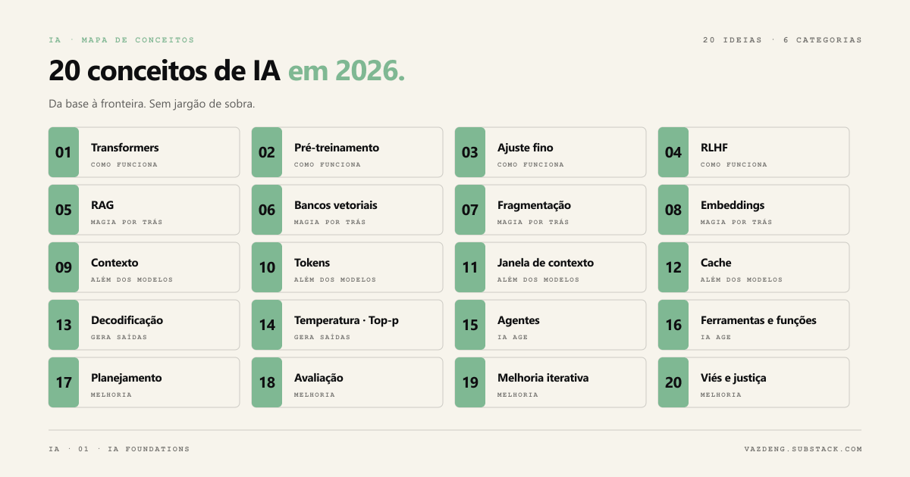

Toda semana aparece um termo novo de IA. Agente, RAG, fine-tuning, embedding, top-p, RLHF. Você abre o LinkedIn e três pessoas já estão "construindo agentes autônomos" antes do café da manhã. No Twitter alguém reclama que o RAG dele alucina, enquanto o post do lado debate se vale a pena fine-tunar Llama 3. Aí você vai na documentação da API que ia testar pra resolver uma coisa simples e cai num glossário de cem palavras antes da primeira chamada útil.

O problema não é a quantidade de termos. É que ninguém para pra desenhar como eles se conectam.

Esse infográfico é a minha tentativa de mapa. Vinte conceitos, seis seções, uma sequência que faz sentido se você for da base pra fronteira. Está longe de cobrir tudo que existe em IA. Mas dá pra abrir ele numa reunião técnica em 2026 e entender do que estão falando, ou ler o código de um sistema agêntico e identificar o que cada peça faz no fluxo.

## Como a IA funciona (1 a 4)

Tudo começa em **redes neurais**. Camadas de neurônios conectados por pesos, ajustados durante o treinamento pra fazer previsões. É a única primitiva de tudo isso. Modelo que vê imagem, modelo que escreve texto, modelo que entende áudio: todos são variações dela, com escolhas diferentes de arquitetura por cima.

Pra linguagem entrar nessa rede, precisa virar número. Esse é o trabalho da **tokenização**: quebrar texto em pedaços que o modelo consegue mastigar. A IA não lê palavras. Lê tokens. Depois cada token vira um vetor num espaço de centenas de dimensões, e isso é **embedding**. Significados parecidos ficam perto. É o que faz busca semântica, recomendação e RAG funcionarem.

E no topo desses três vem **atenção**. O mecanismo que deixa cada palavra olhar pra todas as outras da entrada e decidir o que importa pra ela. Antes de atenção, modelos liam texto em sequência e esqueciam o começo no meio da frase. Atenção quebrou esse gargalo. Sem ela, o resto da IA contemporânea simplesmente não existiria no formato que a gente conhece hoje.

## A mágica por trás (5 a 8)

**Transformers** são a arquitetura que empacotou atenção em algo treinável em paralelo. Antes deles, modelos de linguagem eram lentos e curtos. Depois deles, viraram GPT, Claude, Gemini.

Mas arquitetura sem dado é nada. **Pré-treinamento** é a fase em que o modelo lê o equivalente a uma biblioteca de Alexandria. Trilhões de tokens. É aqui que ele absorve sintaxe, gramática, fatos sobre o mundo e os padrões de raciocínio que os humanos deixaram escritos. **Ajuste fino** é o que vem depois: pegar esse modelo geral e especializar em tarefa específica com dado específico. E **RLHF** é a etapa que pegou modelos que sabiam responder qualquer coisa e ensinou eles a responder de um jeito que serve pra alguém. Pessoas reais comparam saídas, dizem qual é melhor, o modelo aprende a preferência. É o que separa "modelo que sabe muito" de "modelo que conversa bem".

## Além dos modelos (9 a 12)

Modelo nenhum vai pra produção sozinho. Em volta dele vai uma camada de **salvaguardas**: filtros e classificadores construídos sobre regras explícitas, pra evitar que o sistema diga coisa que machuca alguém ou que reproduz viés óbvio. É a parte chata que ninguém quer construir e que todo produto sério precisa ter.

E quando o modelo precisa saber algo que não estava no pré-treinamento, entra **RAG**. Geração aumentada por recuperação. O sistema busca documentos relevantes, injeta no contexto, e o modelo responde ancorado neles. RAG depende de dois primos: **bancos vetoriais** (que armazenam embeddings de forma que dá pra achar o mais parecido em milissegundos) e **fragmentação** (que quebra documentos grandes em pedaços indexáveis). RAG sem boa fragmentação é RAG que alucina elegantemente. Eu vi mais sistema RAG quebrar por chunking ruim do que por qualquer outro motivo isolado.

## Como a IA gera saídas (13 a 14)

Quando o modelo responde, ele não escreve a frase inteira de uma vez. Ele prevê um token, depois o próximo, depois o próximo. Isso é **decodificação**. E o jeito que ele escolhe cada próximo token muda completamente o caráter da saída. **Temperatura** alta dá criatividade e variação. **Top-p** baixo dá foco nas opções mais prováveis. Mexer nesses dois parâmetros é a diferença entre um modelo que escreve poesia e um modelo que escreve documentação técnica.

## Como a IA age (15 a 16)

Até aqui o modelo só responde. **Agentes** são o passo seguinte: ele decide e age. Recebe um objetivo, decompõe em passos, escolhe qual ferramenta usar, executa, observa o resultado, ajusta o próximo passo. **Ferramentas e funções** são as mãos que damos pra esse agente: API, calculadora, busca, execução de código, acesso a banco. Sem isso o agente fica preso na própria cabeça falando sozinho. Toda a parte que importa de sistema agêntico começa quando o modelo finalmente pode chamar alguma coisa que muda estado no mundo real.

## Melhoria e avaliação (17 a 20)

Sistema agêntico sem **planejamento** explícito vira caos rápido. Sem **avaliação** rigorosa, qualquer afirmação sobre o modelo virou torcida. **Melhoria iterativa** é o que separa protótipo bonito de sistema que sobrevive em produção: testar, medir, ajustar, repetir. E **viés e justiça** tem uma característica chata: se você ignora no design, vai te encontrar no incidente.

## Fechamento

IA não é mágica. É matemática com dados em cima, lógica em volta e iteração no centro. Quem entende esses vinte conceitos lê arquitetura de sistema agêntico sem se perder no glossário. Consegue debugar comportamento esquisito do modelo a partir de hipóteses reais, não chute. E numa conversa técnica fala como quem participou da construção, não como quem leu o release.

Pega o infográfico. Salva no celular, imprime e cola na parede, joga no Notion. Eu volto nele toda vez que aparece um termo que parece novo, e quase sempre o termo é um caso particular de um desses vinte. E mais importante que tudo isso: constrói alguma coisa com ele. É quando você tenta fazer um RAG funcionar de verdade que descobre o que cada uma dessas palavras realmente quer dizer.

---

*Esse é o primeiro post da trilha IA Foundations no [VazDEng](https://vazdeng.substack.com). Por lá saem três posts por semana sobre engenharia de dados em português, no nível sênior que faltava na BR.*
