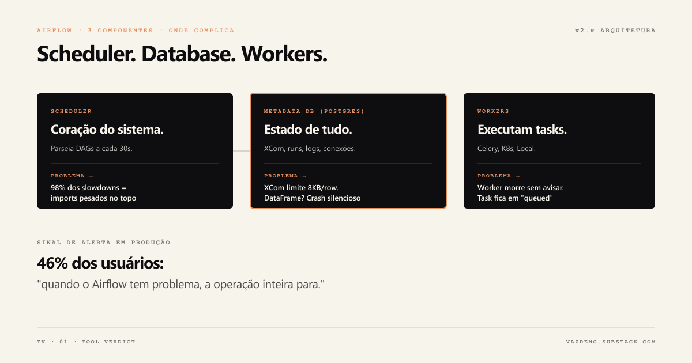
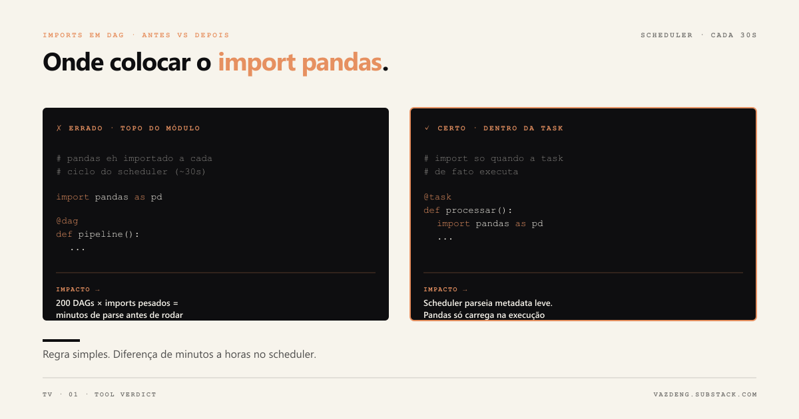
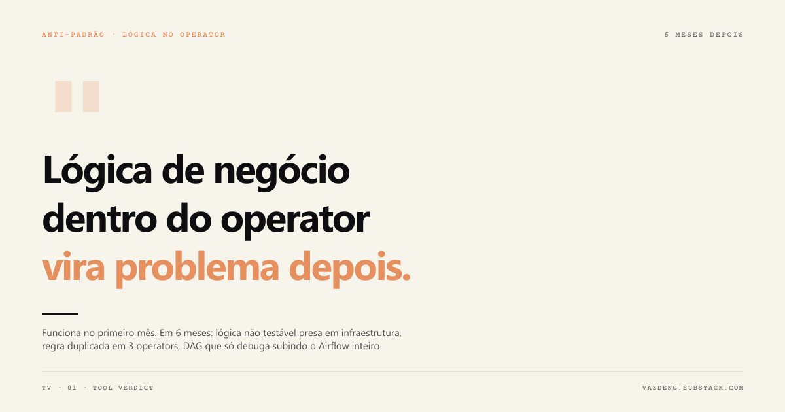

Era 2h da manhã quando o alerta chegou. O DAG de relatório mensal tinha falhado no step 8 de 12. Dados financeiros, prazo 6h da manhã, e eu passei as 4 horas seguintes tentando entender se a task realmente falhou, se foi timeout silencioso, ou se o worker tinha morrido sem avisar ninguém. Quando descobri que era a terceira coisa, faltavam 40 minutos.

Esse cenário é rotineiro em times que usam Airflow em produção. O Airflow funciona. E também cria trabalho que ninguém avisa no primeiro tutorial.

Esse post não é para convencer ninguém a abandonar o Airflow. É sobre o que vale mudar antes que o problema apareça.

## Contexto: o que é e quem usa

O Airflow foi criado por Maxime Beauchemin no Airbnb em outubro de 2014 para orquestrar pipelines de dados com dependências complexas. Virou open source em junho de 2015 e projeto top-level da Apache Foundation em janeiro de 2019.

Hoje é o orquestrador de dados mais usado no mundo: 320 milhões de downloads só em 2024, dez vezes mais que o segundo colocado. Uber roda 200.000 pipelines com 750.000 task runs por dia. Shopify tem 10.000 DAGs ativos. Stripe processa 150.000 tasks diárias.

É adoção real, não hype.

Mas o mesmo relatório que aponta esses números também revela que 46% dos usuários dizem que quando o Airflow tem problema, a operação inteira para. Essa é a tensão que ninguém conta no primeiro tutorial.

## O que o Airflow resolve bem

**Dependências entre tasks são garantidas.** Você define o grafo em Python. O Airflow garante que task B só roda quando task A termina com sucesso. Com 50 tasks interdependentes num pipeline financeiro, ter isso garantido por um orquestrador evita reescrever lógica de retry e dependência em cada DAG, e elimina a categoria inteira de bug "task rodou antes da hora porque o cron disparou".

**Retry com backoff é nativo.** Duas linhas e sua task tenta de novo automaticamente. Em pipelines que dependem de APIs externas instáveis, isso elimina alertas às 2h da manhã para erros transitórios.

**O histórico de execução é auditável.** Toda execução, cada task, cada log fica registrado. Quando compliance pergunta "o relatório de março foi gerado com dados de 31/03 ou de 01/04?", você abre o Airflow e responde em segundos.

**Backfill funciona.** Pipeline parado por três dias? Você reprocessa as execuções históricas com um comando. Para pipelines que precisam de histórico completo e consistente, isso importa muito.

## Onde o Airflow complica



### O scheduler parseia todo o seu código a cada 30 segundos

O scheduler precisa executar o código Python de cada arquivo DAG repetidamente para entender o que existe e quais são as dependências. Com 200 DAGs, esse ciclo de parse pode levar minutos.

O que torna isso crítico: 98% dos casos de lentidão no scheduler são causados por imports pesados no nível do módulo. Um arquivo que faz `import pandas as pd` no topo, fora de qualquer função, faz o scheduler executar esse import a cada ciclo. Em 200 DAGs com imports pesados, isso vira minutos de parse antes de qualquer task executar.

```python
# Errado: pandas é importado a cada ciclo do scheduler
import pandas as pd

@dag
def pipeline():
    ...

# Certo: import apenas quando a task executa
@task
def processar():
    import pandas as pd
    ...
```



### XCom tem limite severo que ninguém avisa no começo

XCom é o mecanismo do Airflow para tasks se comunicarem. O problema: foi projetado para mensagens pequenas, não para dados.

No PostgreSQL, o limite default de linha é 8KB. Um DataFrame de 1.000 linhas vai explodir o XCom. Em produção, o erro aparece como timeout ou crash silencioso do metadata database, não como uma mensagem clara de "dado grande demais".

A solução usada em produção: passar apenas o path no S3 via XCom, nunca o dado em si.

### catchup=True já disparou backfills indesejados em muitos times

Por padrão em versões antigas, se você reimplantar um DAG com `start_date` no passado e `catchup=True`, o Airflow vai criar e tentar executar todas as runs históricas desde `start_date`. Com um DAG mensal e `start_date` dois anos atrás, isso são 24 runs disparadas de uma vez.

A DoubleVerify documentou que depois de migrar para um setup com `catchup=False` como padrão do cluster e outras mudanças, os incidentes caíram 80%.

### Renomear um DAG perde todo o histórico

Não existe operação de rename no Airflow. Renomear um DAG cria uma entrada nova no metadata database e perde todo o histórico de execuções. Em produção, isso significa que você não consegue comparar o comportamento atual com o passado, e qualquer alert que dependa do histórico quebra.

### Lógica de negócio dentro do operador vira problema depois

A tentação é colocar transformações e regras de negócio direto dentro do `PythonOperator`. Funciona no começo. Depois de seis meses, você tem lógica não testável presa dentro de infraestrutura, a mesma regra duplicada em três operadores diferentes, e um DAG que só dá para debugar subindo o Airflow inteiro.

O padrão correto: o operador é infraestrutura e chama funções testáveis que vivem fora do DAG.



## O que eu faria diferente

**TaskFlow API desde o primeiro dia.** Lançada no Airflow 2.0, permite escrever DAGs com decoradores Python em vez de instanciar operadores manualmente. O código fica mais limpo, as dependências ficam implícitas no fluxo, e é mais fácil de testar. Passei tempo demais escrevendo no estilo antigo antes de migrar.

**`catchup=False` como padrão do cluster na configuração inicial.** Uma linha em `airflow.cfg` que evita dezenas de incidentes.

**Resource pools desde o primeiro DAG.** Por padrão o Airflow não limita quantas tasks de um DAG rodam em paralelo. Um DAG pesado pode consumir todos os slots e bloquear os outros. Configurar pools antes do primeiro problema, não depois.

**Nada de multi-tenant numa mesma instância.** Compartilhar uma instância Airflow entre times diferentes cria conflitos de dependências Python, falta de isolamento de recursos, e upgrade paralysis: um time não consegue atualizar sem coordenar com todos os outros. Uma instância por time é o padrão recomendado.

**Monitorar o scheduler, não só as tasks.** O scheduler é o coração do Airflow e pode degradar silenciosamente. Grafana no heartbeat do scheduler identifica problemas antes que as tasks comecem a falhar.

## Sobre o Airflow 3.0

Em abril de 2025 o Airflow lançou a versão 3.0, a maior release da história do projeto. Ela resolve problemas que a comunidade documentou durante anos: Task Execution API que elimina a necessidade dos workers acessarem diretamente o banco de metadados, DAG Versioning nativo, interface React reconstruída, e suporte a tasks em múltiplas linguagens além de Python.

Se você está começando um projeto novo, avalie o Airflow 3.0 antes de escolher a versão a instalar. As mudanças são breaking, então migrar um cluster existente exige planejamento.

## Quando avaliar alternativas

O Airflow tem 320 milhões de downloads por uma razão: ele funciona, tem o maior ecossistema de integrações do mercado, e a comunidade é vasta.

Mas existem casos onde outras ferramentas resolvem melhor:

**Prefect ou Dagster** para times menores que valorizam desenvolvimento local simples, workflows event-driven, e observabilidade mais rica sem overhead operacional do Airflow.

**dbt Cloud** quando a maioria dos pipelines são transformações SQL num warehouse. A orquestração nativa é mais simples para esse caso específico.

**Airflow gerenciado** (Astronomer, Amazon MWAA, Google Cloud Composer) se o custo cabe e você não quer manter a infraestrutura. Remove parte significativa da dor operacional.

O que não vale é escolher pela popularidade sem avaliar se o problema que o Airflow resolve é o seu problema.

## O que fica

O Airflow funciona bem para o que foi feito: orquestrar pipelines batch com dependências complexas, histórico auditável e retry confiável.

Os problemas que encontrei foram quase todos evitáveis com configuração correta desde o início: imports fora de funções, XCom para dados grandes, catchup sem controle, lógica de negócio dentro de operadores.

Se você está começando: imports dentro das funções, `catchup=False` no cluster, XCom só para coordenação, lógica de negócio em módulos testáveis separados. São quatro decisões que evitam a maioria dos problemas que eu encontrei.

Qual foi o problema mais irritante que você já viu com Airflow? Me conta no [LinkedIn](https://linkedin.com/in/thaisvaz) ou assina a [newsletter](https://vazdeng.substack.com).
