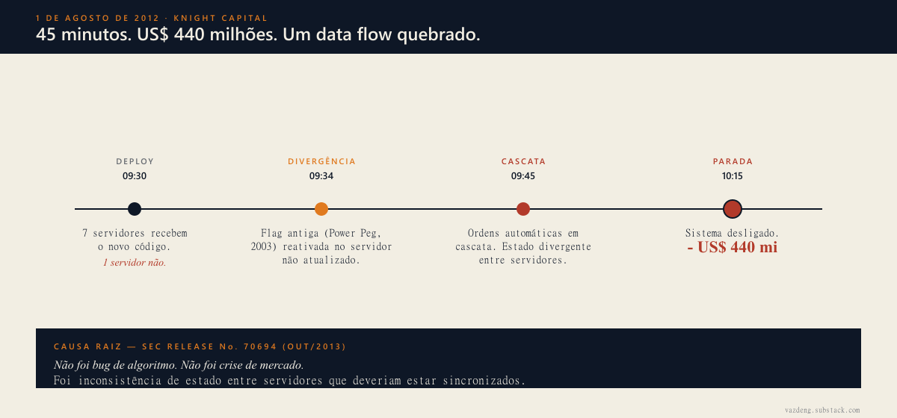
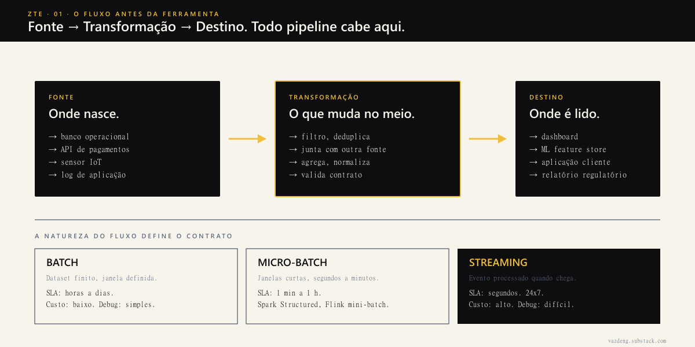

Em 1 de agosto de 2012, a Knight Capital perdeu 440 milhões de dólares em 45 minutos.

Não foi bug de algoritmo. Não foi crise de mercado. Foi um único servidor entre oito que recebeu o deploy do novo código, enquanto outro manteve uma flag antiga reativada (Power Peg, código de 2003). Os dois rodaram em paralelo. O resultado foi uma cascata de ordens automáticas que ninguém conseguiu parar.

O SEC documentou o caso (Release No. 70694, outubro 2013): a causa raiz não era um erro de lógica de trading. Era inconsistência de estado entre servidores que deveriam estar sincronizados. Em linguagem de engenharia de dados, era um data flow quebrado.

A Knight Capital tinha algoritmos sofisticados. Tinha mais de uma década de operação. O que não tinha era um modelo mental claro sobre onde o dado nascia, por onde passava, e onde precisava chegar de forma consistente.

Esse modelo mental é o que define o resto. Eu trabalho com dados há tempo suficiente pra ter visto, em escalas menores, variações dessa mesma falha. Antes de Apache Spark, antes de dbt, antes de Snowflake, antes de qualquer ferramenta, existe um conceito que separa pipeline robusto de pipeline frágil.

## Em uma frase

> Data flow é o caminho que o dado percorre da fonte até o destino, com toda transformação no meio. Acertar esse caminho é decisão arquitetural. Errar custa caro.

## De onde veio essa ideia

Não é nova. Bill Inmon publicou *Building the Data Warehouse* em 1992 defendendo arquitetura top-down, normalizada, enterprise-wide. Ralph Kimball respondeu em 1996 com *The Data Warehouse Toolkit*: bottom-up, modelagem dimensional, data marts compondo o todo. O debate Inmon vs Kimball dominou os anos 90 e ainda aparece em qualquer revisão de arquitetura.

O que mudou entre 1996 e 2026 não foi o conceito, foi a escala. Em 2017, Martin Kleppmann publicou *Designing Data-Intensive Applications* e formalizou no capítulo 11 a distinção que organiza a engenharia de dados moderna:

> *"A stream refers to data that is incrementally made available over time... in contrast to batch processing, where the input is a known, finite size."*

Bounded vs unbounded. Um conjunto de dados com tamanho conhecido (batch) versus um que nunca termina (stream). Toda decisão de arquitetura de dados começa nessa distinção.

Em 2021, o paper do Lakehouse (Armbrust, Ghodsi, Xin, Zaharia, CIDR) propôs unificar warehouse e lake via metadata layer (Delta, Iceberg, Hudi). Em 2020, o pessoal da dbt Labs popularizou ELT no lugar de ETL: transformação dentro do warehouse, não antes. Cada onda mudou ferramenta, não princípio.

## Bounded vs unbounded: a decisão que define tudo

Toda decisão de pipeline começa aqui. Resumo prático em tabela:

| Tipo | Característica | Quando usar | Custo |
|---|---|---|---|
| **Batch** | Dataset finito, processado em janela definida | SLA de horas, relatórios contábeis, snapshots históricos | Simples de construir, debugar, recuperar |
| **Streaming** | Dataset infinito, evento processado quando chega | SLA de segundos a poucos minutos, fraude em tempo real, dashboards operacionais | Complexo, exige watermarks, exactly-once, observabilidade pesada |
| **Micro-batch** | Streaming em janelas curtas (segundos a minutos) | Meio termo: dashboard de minutos, ML feature store próximo do real-time | Spark Structured Streaming, Flink mini-batches |

Tyler Akidau e equipe (Google) publicaram em VLDB 2015 o paper *The Dataflow Model* que formalizou o vocabulário moderno: event time, processing time, watermarks, triggers, windowing. A frase central:

> *"A practical approach to balancing the inherent tension between correctness, latency, and cost in massive-scale, unbounded, out-of-order data."*

Tradução: streaming é correto em três variáveis ao mesmo tempo. Você não maximiza as três, escolhe duas e paga a terceira.

## Quando batch, quando streaming

A regra prática que eu uso é simples: SLA de latência aceitável define a resposta.

- **SLA acima de 1h** tende a batch. Reprocessamento simples, debugging direto, infraestrutura barata.
- **SLA abaixo de 1 minuto** exige streaming. Quem tenta forçar batch nesse cenário cria janelas tão curtas que reinventa streaming com o pior dos dois mundos.
- **SLA entre 1 minuto e 1h** é zona de micro-batch. Spark Structured Streaming ou Flink mini-batches resolvem.

Jay Kreps, fundador do Confluent, escreveu em 2014 o ensaio *Questioning the Lambda Architecture* atacando o modelo proposto por Nathan Marz, que mantinha duas camadas paralelas (batch + speed). A frase que ficou:

> *"The problem with the Lambda Architecture is that maintaining code that needs to produce the same result in two complex distributed systems is exactly as painful as it seems."*

Kreps propôs Kappa: log unificado (Kafka) como fonte de verdade, reprocessamento via replay. Kappa virou padrão em quem opera streaming sério.

O erro mais comum que eu vejo é forçar streaming porque "soa moderno". Streaming não é versão melhor de batch. É contrato diferente, custo diferente, modelo mental diferente. Quando a decisão é tomada por moda em vez de por SLA, a equipe gasta meses construindo complexidade que o problema não pediu, e eu já passei por essa armadilha mais de uma vez.

## O que dá errado quando ignoram o flow

Knight Capital não foi um acidente isolado. O padrão se repete em outras escalas.

**GitHub, outubro de 2018**: outage de 24 horas. Causa raiz documentada pelo Jason Warner (post-mortem oficial): 43 segundos de partição de rede entre data centers no US East causaram divergência no failover do MySQL Orchestrator, replication storm e inconsistência cross-DC. Foi falha pura de data flow na camada de replicação.

**Airbnb, antes da Minerva**: equipes diferentes calculavam "active user" com queries divergentes no mesmo Spark cluster. Métricas batiam de cabeça em reuniões executivas. A solução não foi outro dashboard, foi uma camada única de definição de métricas com lineage explícito da fonte ao destino. O Minerva indexa hoje mais de 200 mil data assets.

Esses casos cabem em padrões nomeados na literatura. Vale conhecer cada um:

- **Pipeline jungle** (Sculley et al, NeurIPS 2015, *Hidden Technical Debt in Machine Learning Systems*): *"pipeline jungles often appear as data preparation evolves organically... testing such pipelines requires expensive end-to-end integration tests."* É o que acontece quando ninguém desenhou o flow no começo e ele cresce por adição.
- **Data swamp** (Nick Heudecker, Gartner 2014): *"lakes turn into swamps when there is no metadata, governance, or quality control."* Lake virou pasta de arquivos jogados em qualquer lugar.
- **Schema drift**: campos mudam sem aviso entre runs, contratos downstream quebram silenciosamente.
- **Lineage gaps**: ninguém sabe de onde veio o dado que está no dashboard.
- **Reverse-ETL chaos**: dado volta do warehouse pra SaaS sem governança, vira fonte secreta de verdade que ninguém audita.

## Como os grandes documentam o próprio flow

Empresas que operam dado em produção real publicam a arquitetura. Vale ler.

| Empresa | Documento | Anchor |
|---|---|---|
| **Netflix** | *Maestro: Netflix's Workflow Orchestrator* (TechBlog, jul 2024) | Orquestra centenas de milhares de workflows por dia, padrão WAP (Write-Audit-Publish) sobre Iceberg |
| **Uber** | *Uber's Big Data Platform* (Eng Blog, out 2018) | Hudi reduziu latência de ingestão de 24h para menos de 1h em 100+ PB |
| **Airbnb** | *Democratizing Data at Airbnb* (mai 2017) | Dataportal indexa 200K+ data assets com lineage explícito |
| **Stripe** | *Online migrations at scale* (Eng Blog, fev 2017) | Dual-write + backfill + reconciliation para migrar dados financeiros sem perda |
| **Slack** | *How We Built Slack's Data Warehouse* (set 2023) | Migração de Presto+Hive para Trino+Iceberg, 60K queries por dia |

Padrão comum: cada uma documentou o flow antes de construir a próxima ferramenta. Ferramenta nasceu a partir do diagrama, não o contrário.

## Anti-padrões pra evitar

1. **Forçar streaming porque soa moderno**. Se SLA é diário, batch resolve com 10% da complexidade.
2. **Construir pipeline sem desenhar o flow primeiro**. Pipeline jungle é literalmente isso: crescer sem mapa.
3. **Aceitar lake como "joga tudo aqui que organizo depois"**. Vira swamp em 6 meses.
4. **Ignorar schema contracts**. Schema drift quebra downstream silenciosamente. Use Schema Registry ou contrato versionado em SQL.
5. **Manter duas implementações paralelas (Lambda)**. Custo de manutenção dobra, comportamentos divergem, ninguém confia em nenhuma.
6. **Pular lineage**. Lineage não é luxo. É a única forma de responder "de onde veio esse número" sem abrir 12 jobs.

## Onde começar

Você consegue desenhar, em um guardanapo, o data flow do seu pipeline mais crítico? Fonte exata, transformações principais, destinos, SLA por etapa.

Se sim, está à frente da maioria. Se não, comece por aí. Antes de Spark, antes de dbt, antes de qualquer ferramenta nova.

Os próximos episódios da série Zero to Expert vão entrar em cada camada com profundidade: ingestão (formatos, idempotência, CDC), transformação (SQL vs Python vs Spark), destino (warehouse vs lake vs lakehouse), orquestração. Cada episódio com caso concreto e decisão no centro, não teoria.

Se tem algum conceito específico que você quer ver coberto, me manda no [LinkedIn](https://linkedin.com/in/thaisvaz) ou assina a [newsletter](https://vazdeng.substack.com) pra receber os próximos episódios.
