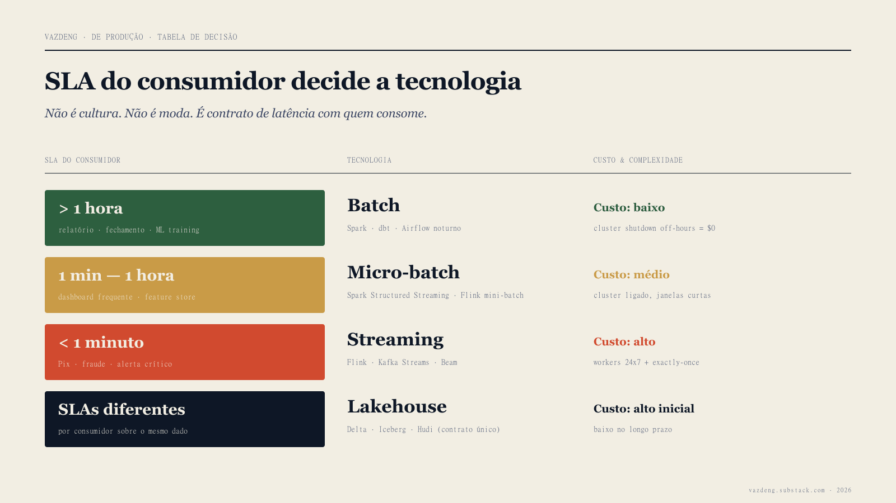

I watched a marketing team do what every team does once: adopt streaming because it sounded modern. Managed Kafka, 24x7 workers, exactly-once guarantees. To process events arriving every 10 minutes. Nightly batch would solve the same. It cost a tenth. It took six months until someone measured.

The pattern repeats. I have walked through the same decision in four different domains: finance pipelines, industrial processes, marketing, analytics. The discussion always starts wrong. "Let's go streaming because it is more modern." Or "let's keep batch because it is what we always did." Both miss the right question.

The right question is one: what is the real SLA of the consumer that will use this data?

## The right question is not "which is more modern"

Martin Kleppmann formalizes in chapter 11 of *Designing Data-Intensive Applications* the distinction that organizes any data architecture in 2026. **Bounded** data (finite set, known size) versus **unbounded** (a stream that never ends). Every decision starts there.

But the bounded/unbounded distinction is technical, not behavioral. Real data is rarely just one thing. Application logs are unbounded by nature. If I aggregate them in 1-hour batches to feed a dashboard nobody looks at more than once an hour, the consumer is treating it as bounded. Data is what the consumption decides.

Tyler Akidau and team at Google published in 2015 the paper that became the industry standard, *The Dataflow Model*. The central line:

> *A practical approach to balancing the inherent tension between correctness, latency, and cost in massive-scale, unbounded, out-of-order data.*

Translation: streaming is right on three variables at the same time. Correctness, latency and cost. You pick two, you pay for the third. Batch is simpler precisely because it does not try to optimize latency.

## Decision table: SLA × technology

For most pipelines I see, the table above resolves the decision in 30 seconds. SLA above 1 hour is batch territory. SLA below 1 minute requires streaming. The middle is micro-batch, and most cases land there, not at the extremes.

## When batch wins (even in 2026)

Spotify runs recommendations in nightly batch on BigQuery. Netflix has Maestro orchestrating hundreds of thousands of workflows per day with the Write-Audit-Publish pattern over Iceberg. Neither is "late". They chose batch where batch solves better.

Batch wins when:

- Consumer SLA is hourly or daily (accounting report, closing, historical snapshot, ML training)
- Input data is stable enough that you can reprocess whenever you want
- Your team has more ease debugging Python that runs once a night than a 24x7 stream processor

Cost matters a lot. A nightly batch Spark cluster stays off during the day. Infrastructure when no job is running: zero. Managed Kafka is always on. Confluent Cloud Standard starts at $1k to $3k per month, and egress can hit $47k per month at 300 MiB/s outbound. The difference over a year is the salary of a mid-level engineer in Curitiba.

## When streaming is the only answer

Pix has an SLA under 10 seconds, 24x7. BACEN publishes this. Daily batch does not work. Not optional. Point-of-sale fraud detection is the same: either identify before the transaction closes or it serves nothing. Call center ops dashboard, same logic: the agent needs to see the customer updated the moment they answer.

These cases do not allow batch. Streaming is the only answer.

For them, Flink delivers latency under 100 milliseconds. Spark Structured Streaming sits at 100 milliseconds to 1 second (micro-batch). Kafka Streams runs embedded in the application, without its own cluster, and processes around 1 million events per second. Choosing between the three is another post.

Uber is the most interesting case. Adopted streaming without going 100% streaming. Added Hudi for incremental processing and brought ingestion latency from 24 hours to under 1 hour on more than 100 PB. Their Flink IngestionNext consumes 25% less compute than the old batch. Streaming done right also saves, as long as it solves the right problem.

## When "both" is the right answer

Jay Kreps published in 2014 the essay that killed Lambda Architecture. Lambda keeps two parallel pipelines to produce the same result: one batch and reliable, one streaming and fast. The line that stuck:

> *The problem with the Lambda Architecture is that maintaining code that needs to produce the same result in two complex distributed systems is exactly as painful as it seems.*

Kreps proposed Kappa: single log (Kafka) as source of truth, reprocessing via replay. Batch becomes a special case of streaming over the history.

Lakehouse was a step further. The Databricks 2021 paper proposes a metadata layer (Delta, Iceberg, Hudi) that serves both natures. The same data can be consumed in batch by the BI team and in streaming by the fraud application. No 2 stacks. One contract.

"Both" is not technical cowardice. It is conscious design when you have consumers with different SLAs over the same data.

## Questions that decide the case

Before opening Terraform or docker-compose, answer this honestly:

1. **What is the real SLA of the consumer that will read this data?** Not the SLA you imagine. What they actually need.
2. **Is this SLA different per consumer?** If yes, consider Lakehouse with a single contract, not 2 parallel pipelines.
3. **How much does it cost to run 1 month of streaming vs batch at this volume?** Do the math before, not after the invoice.
4. **Does your team have maturity to debug exactly-once, watermarks and distributed state?** If not, the learning cost comes embedded in the project.
5. **Do you already have batch or streaming infrastructure running?** Reusing reduces risk. Greenfield lets you pick better.

If you answered honestly and still landed on streaming, great. Streaming makes sense. If you landed on batch, great too. Batch solves most cases.

The mistake is not picking streaming. The mistake is picking streaming without answering them.

---

Which pipeline did you pick wrong and had to redo later? Tell me on [LinkedIn](https://linkedin.com/in/thaisvaz) or reply to this email. I want to see how many cases match.
