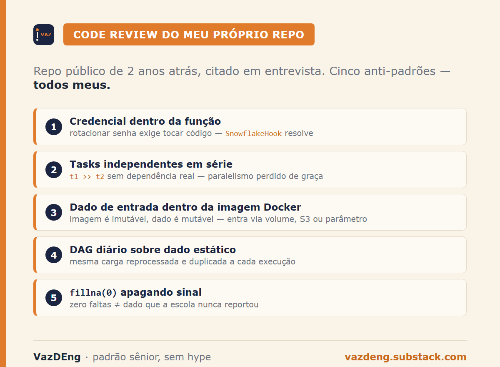
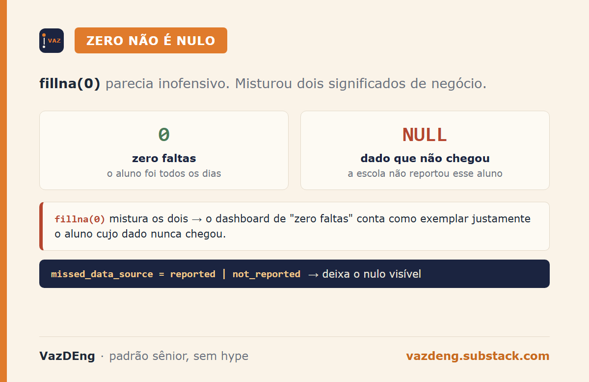

I opened a two-year-old repo of mine. It was still public on GitHub, I cited it in interviews, and I had never re-read the code since I submitted it. This weekend I sat down to re-read it.

I found five anti-patterns. In my own code, written by me. But the kind of problem I see show up in real production pipelines at large companies, not just in interview projects.

I decided to write about it because it's more honest to critique my own code than to point fingers at someone else's repo. And because if you have a public repo from two years ago that you still cite in your portfolio, you probably also have at least three of these five.



## The database credentials were inside the function

```python
def load_data_to_snowflake(df_merged):
    conn = snowflake.connector.connect(
        user='thaiscxxx',
        password='xxx*',
        account='xxx'
    )
```

I masked it with `xxx` before pushing, but the design pattern is the problem, not the string. Credentials inside the function mean each task that talks to Snowflake duplicates the connection, rotating the password requires touching code, and auditing means grepping the entire repo to figure out who connects where.

The honest version would use a Hook (`SnowflakeHook`) or environment variable, with the connection managed outside the code:

```python
from airflow.providers.snowflake.hooks.snowflake import SnowflakeHook
hook = SnowflakeHook(snowflake_conn_id='snowflake_default')
```

Encrypted, traceable, and never shows up in a pull request.

## The pipeline lost parallelism for free

```python
t1 >> t2 >> t3 >> t4
```

`t1` validated `students.json`. `t2` validated `missed_days.json`. I chained them sequentially, but they're independent. No reason for `t2` to wait on `t1`. With a tiny file, it barely matters. When the JSON weighs gigabytes and validation takes minutes, parallelizing cuts the duration in half.

The correct version:

```python
[t1, t2] >> t3 >> t4
```

Whoever reads the pipeline now understands validation runs in parallel and then joins. Whoever read the original would assume there's some hidden dependency that doesn't exist.

![How I wrote it vs how it should be: t1 >> t2 >> t3 >> t4 in series against [t1, t2] >> t3 >> t4 with validations in parallel](images/02-serie-vs-paralelo.png)

## Input data was baked into the Docker image

In the Dockerfile:

```
COPY files/students.json /students.json
COPY files/missed_days.json /missed_days.json
```

I embedded the input data into the image. Every rebuild assumes the same data. To run the pipeline with a different JSON, I'd have to rebuild the image or change the code. Coupling between execution artifact and input data, in the same place.

The rule I'd preach to others but ignored in my own repo: images are immutable, data is mutable. Data comes in through a mounted volume, S3, GCS, or runtime parameter. Never inside the image.

## The pipeline ran daily on static data

```python
with DAG('migrate_student_data_to_snowflake',
         schedule_interval=timedelta(days=1),
         catchup=False) as dag:
```

I scheduled the pipeline to run every day. The input data is two static JSONs baked into the image (the anti-pattern above). Running daily means processing the exact same files, generating the exact same records, and trying to insert them all again into the same table. On the second run, `write_pandas` would duplicate the rows. On the third, duplicate again.

The data is static. The correct choice would be `schedule_interval=None` (manual or external trigger only) or a sensor that detects a new file in the bucket. Scheduling a pipeline without a mutable source is ceremony: it burns a worker slot every day, fires alerts when it breaks, pollutes the execution history. And when you actually need to run it with new data, the operation becomes indistinguishable from the background noise.

It was meant to run once. I scheduled it to run daily. Subtle, but the kind of choice that produces ceremonial DAGs in production: pipelines that exist without a reason to exist on that cadence.

## The `fillna(0)` erased an important signal

```python
df_merged['missed_days'].fillna(0, inplace=True)
```

When a student appears in `students.json` but not in `missed_days.json`, the join leaves `missed_days` null. I replaced it with zero. It seemed right at the time.

Zero absences carries business meaning: the student showed up every day. A missing record carries another meaning: the school didn't report this student's attendance. Conflating the two masks an upstream data quality issue. A dashboard filtering "students with zero absences" will surface as model students precisely the kids whose data never arrived.

The honest version leaves null and opens a new column marking whether the record exists:

```python
df_merged['missed_data_source'] = df_merged['missed_days'].notna().map(
    {True: 'reported', False: 'not_reported'}
)
```

Small change, completely changes what the dashboard shows.



## The discomfort of reviewing your own code

Rewriting these five snippets today would take an hour. The discomfort of publicly admitting they were wrong is bigger than the hour. But the repo stayed public with the defects, and I cite that repo in my portfolio. Keeping the repo intact and doing an honest review on top is more useful for someone learning than deleting the history and pretending I always wrote clean code.

If you have an old public repo still listed in your portfolio, open it this week. You'll find at least three of these five.
