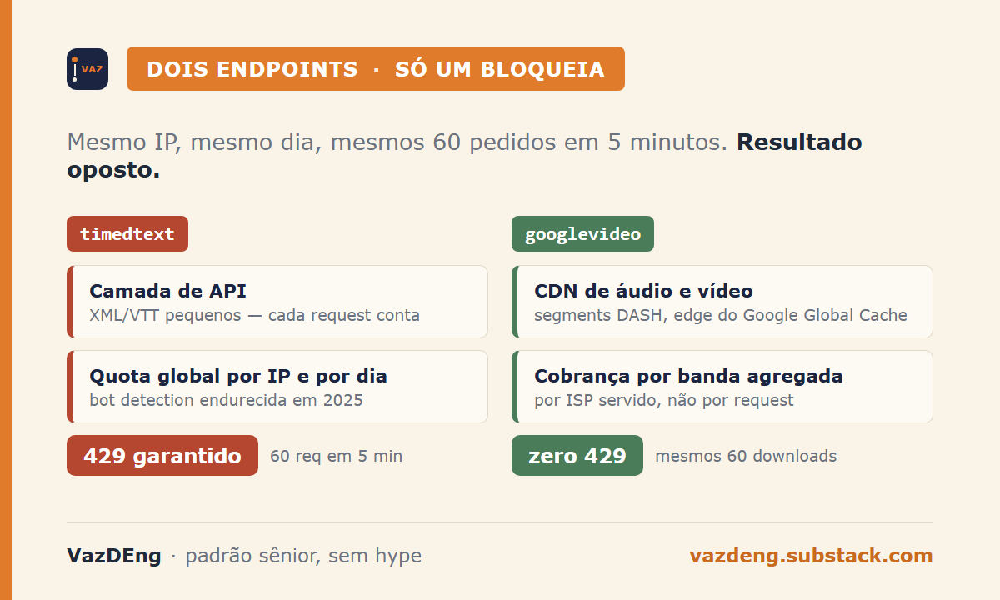
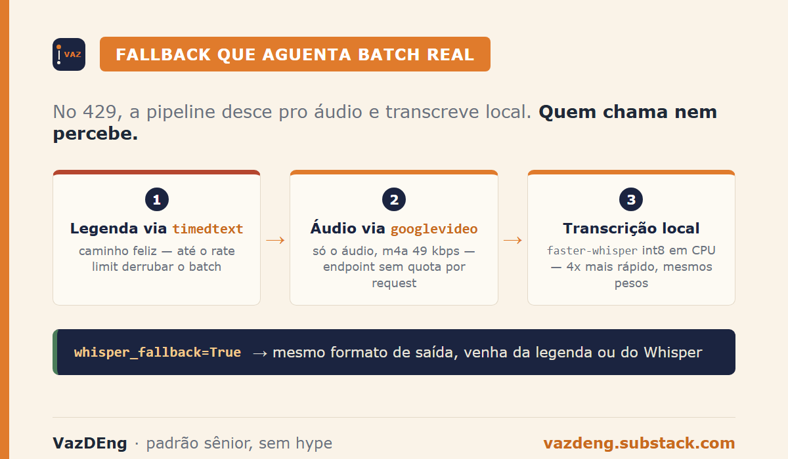
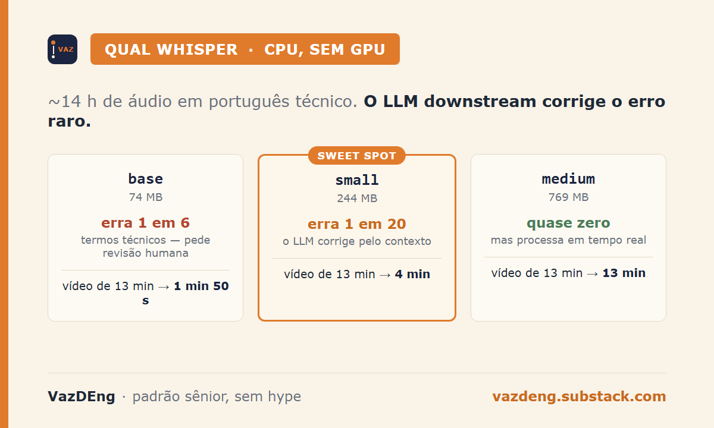

Bati em HTTP 429 do YouTube em 14 vídeos seguidos. Eu tentei `--sleep-subtitles 60`, backoff exponencial até 45s, cookies do Chrome, yt-dlp pré-release. Nada destravou. Todos os pedidos pro `timedtext` voltavam 429.

Mudei pro endpoint de áudio. Zero 429.

> Em uma frase: o `timedtext` (legendas) e o `googlevideo` (áudio/vídeo) do YouTube são endpoints diferentes. Só o primeiro está agressivamente rate-limited em 2026. Baixar áudio e transcrever localmente sai mais barato do que insistir nas legendas.

## O problema que pipelines de transcrição ignoram

O rate limit do `timedtext` virou comum o suficiente em 2026 pra ter 3 issues abertas no yt-dlp (#7123, #13770, #13831), sem fix definitivo. O conselho oficial é caching e usar a YouTube Data API com OAuth. Os dois funcionam mas mudam o problema, não resolvem. Quem rodou 50 URLs num cron e viu metade vazia conhece o sintoma.

## Por que `googlevideo` não cai junto

A descoberta que demorei pra fazer está nas duas camadas distintas que o YouTube expõe. O `timedtext` é uma camada de API: serve XML/VTT pequenos sob quota global por IP e por dia, com cache pesado e bot detection endurecida em 2025. Cada request conta. Já o `googlevideo` é a CDN de vídeo e áudio, que responde via segments DASH a partir de edges do Google Global Cache, com peering direto pro seu ISP. A camada de billing é por banda agregada no servidor que serve seu ISP, não por request individual. O rate limit lá só dispara em padrão claramente robótico.

Na prática que eu vi: 60 requests em 5 minutos no `timedtext` resulta em 429 garantido. Os mesmos 60 downloads no `googlevideo` com intervalo natural passam sem aviso. Esse detalhe não está documentado em lugar óbvio. Eu descobri quando o cron quebrou e abri o Wireshark.



## A pipeline que aguenta batch real

Empacotei a lógica num CLI Python open source chamado [yt-nota](https://github.com/thaiscvaz/yt-nota). Junta 3 ferramentas.

| Etapa | Ferramenta | Custo | Quando falha |
|---|---|---|---|
| Metadata + URL da legenda | `yt-dlp` (Python API) | $0 | Vídeo privado, region lock |
| Áudio fallback | `yt-dlp` formato 139 (m4a 49kbps) | $0 | Members-only sem cookie |
| Transcrição local | `faster-whisper` int8 CPU | $0 | Vídeo > 1h em hardware fraco |

`faster-whisper` é 4x mais rápido que `openai-whisper` no mesmo modelo, com a mesma acurácia (mesmos pesos). A API do meu CLI fica assim:

```python
result = extract_transcript(
    url,
    whisper_fallback=True,   # default ligado
    whisper_model="small",   # ou tiny/base/medium
)
```

No 429, ele desce pro `googlevideo`, baixa só o áudio, transcreve e devolve o mesmo formato. Quem chama nem sabe se veio do `timedtext` ou do Whisper.



## Benchmark em CPU (Intel i7 12ª gen, 16 GB, int8)

Eu rodei o pipeline em vídeos reais de duração variada pra medir tempo de processo. Sem GPU.

| Duração do vídeo | `base` (74 MB) | `small` (244 MB) | `medium` (769 MB) |
|---|---|---|---|
| 5 min | 35 s | 1 min 30 s | 5 min |
| 13 min | 1 min 50 s | 4 min | 13 min |
| 45 min | 6 min | 14 min | 45 min |

Sobre acurácia em português técnico, fiz leitura comparativa em ~14 horas de áudio de aulas. O modelo `base` confunde 1 em cada 6 termos técnicos (95% legível mas pede revisão humana). O `small` confunde 1 em cada 20 (default por uma razão: o LLM downstream corrige os erros raros pelo contexto). O `medium` chega quase em erro zero, mas dobra o tempo. Pro meu fluxo (transcript → síntese via Claude Code), `small` é o sweet spot.



## E os SaaS já existem com Whisper fallback?

Existem. Dois principais em 2026.

| Solução | Preço | Quando faz sentido |
|---|---|---|
| **Supadata** | A partir de $0,001/min, free tier 1000 req/mês | Empresa com SLA, não quer manter infra |
| **Apify YouTube Transcript Scraper** | $0,40 por 1000 actor runs + compute | Pipeline já no Apify |
| **yt-nota self-host** | 250 MB deps + 244 MB modelo | Privacidade, batch acadêmico, controle |

A decisão pra mim é trivial: nota de aprendizado e vault Obsidian não atravessam API de terceiro. Se fosse pipeline corporativo com SLA e auditoria, Supadata ganha por operacional. Self-host só faz sentido quando você é o cliente do dado.

## Verdict honesto

O que funciona: batch de 50+ vídeos sem cair no meio, zero custo recorrente depois dos 500 MB iniciais, qualidade em português técnico boa o suficiente pra LLM digerir depois.

O que cobra: primeira instalação é pesada (`pip install yt-nota[whisper]`), modelo `small` pode confundir termos exóticos (pra áudio crítico, sobe pra `medium`), e CPU vira gargalo em vídeo maior que 1h.

Quando NÃO vale: volume de 10.000 horas por mês com SLA apertado (a Whisper API da OpenAI a $0,006/min sai mais barato por hora-engenheiro do que manter infra), ou áudio com música e várias vozes simultâneas (faster-whisper não faz diarização, pyannote sim).

## Anti-padrões que vi pelo caminho

Confiar no `--sleep-subtitles 60` como bala de prata. Eu testei: ele não dispara antes do request, ele dispara depois do primeiro 429. Já era. Pular pra API paga sem ter tentado o pipeline local também é armadilha. $36k/ano em transcrição (cálculo público do faster-whisper) é dinheiro que devia comprar uma GPU intermediária. E apagar o áudio bruto depois de transcrever é erro de quem nunca quis rerodar com modelo melhor 6 meses depois. Eu guardo.

## O que isso muda pra você

Se você usa YouTube como fonte de aprendizado, entrada de RAG ou pipeline de notas:

- [ ] Sua pipeline atual aguenta 50 URLs em sequência sem cair?
- [ ] Você sabe distinguir 429 de `timedtext` versus 429 de `googlevideo`?
- [ ] Você tem fallback automático ou trata cada falha manual?
- [ ] Custo mensal real da sua transcrição cabe ou já passou de 1 GPU amortizada?

Se respondeu "não" pra mais de uma, vale uma tarde refatorando.
