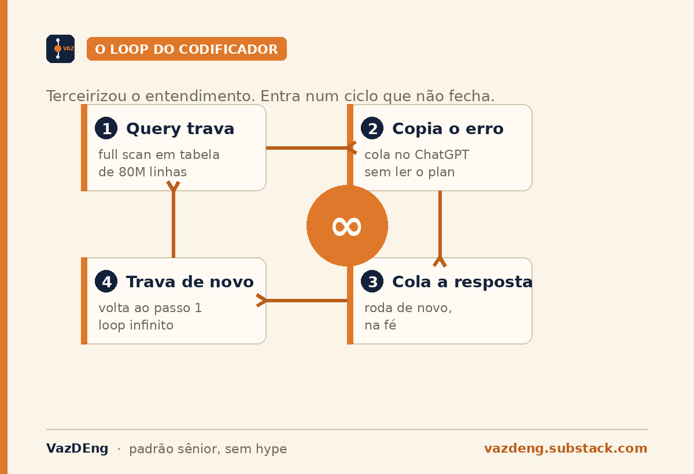
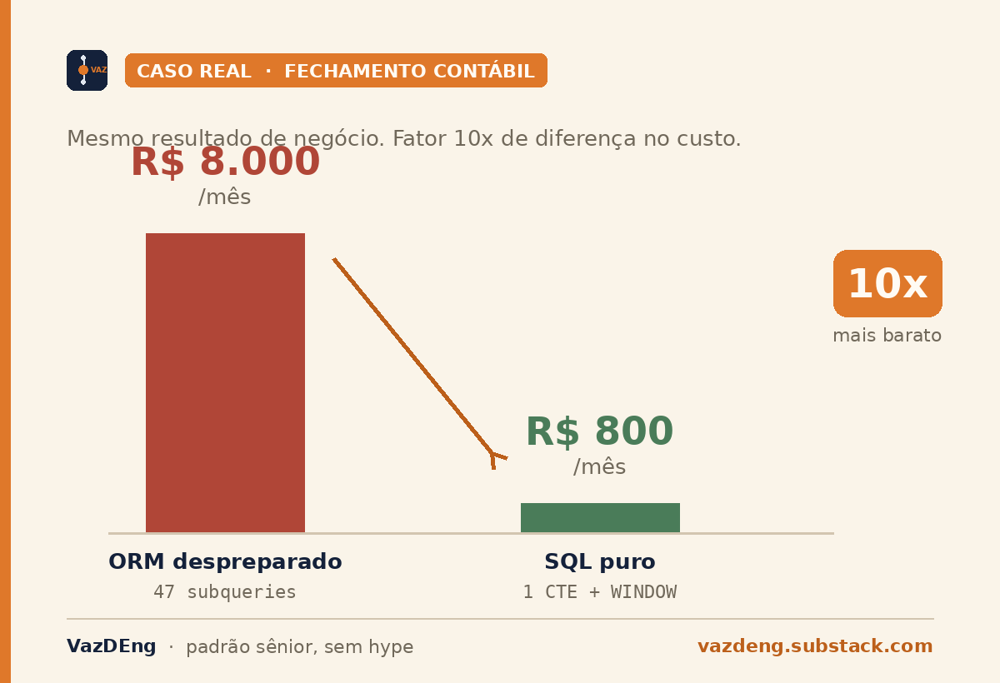
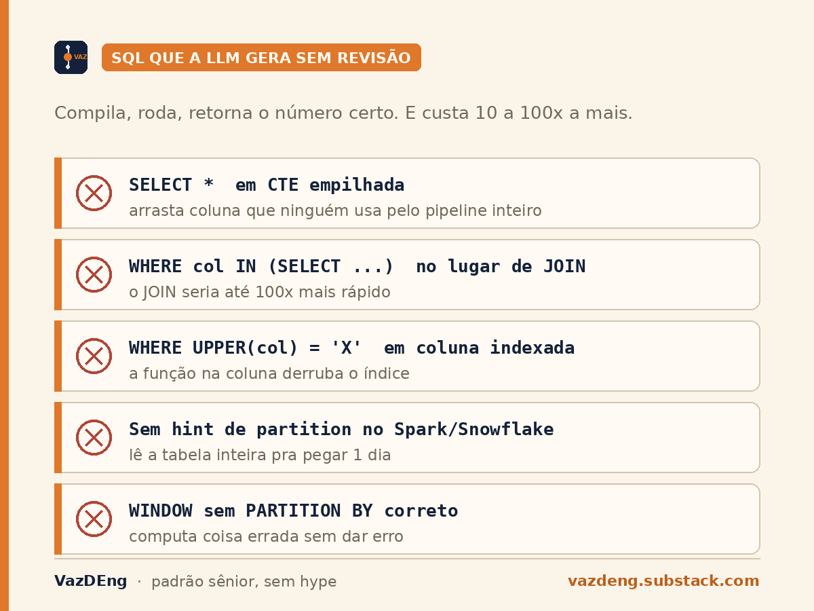

There are devs onboarding into senior teams right now who have never written a `GROUP BY` in their lives. They learned the ORM before SQL. They think `df.groupby()` covers it. When a query hangs because the execution plan turned into a full scan over an 80-million-row table, they paste the error into ChatGPT, paste the answer back, and when it hangs again, they paste again. Infinite loop.

That dev is what Akita calls a coder, as opposed to an engineer. And AI is accelerating his extinction.

## The coder outsourced the understanding

I learned SQL before any framework, because it was the only way to talk to the database. Today it's the opposite. Framework before SQL. ORM before SQL. pandas before SQL. Layer upon layer of abstraction hiding the query that will actually run.

The problem with abstraction is not the abstraction. It's that it hides the cost. You assume `User.objects.filter().select_related().prefetch_related()` is cheap. It isn't. It's a JOIN that can blow up memory if you don't know why it's a JOIN, across how many tables, with what cardinality. The ORM writes the right query in 70% of cases. The other 30% destroy your cluster.

## In a real pipeline, the abstraction doesn't fit

A modern data pipeline processes billions of rows a day. Every query decision costs minutes times cluster times DBU times day times month. The gap between a well-written query and one generated by an unprepared ORM is a 10x to 100x factor on the final bill.

A concrete case from a consulting engagement: an accounting close pipeline at a Brazilian fintech. The ORM was generating 47 subqueries for something native SQL solves in 1 CTE with a window function. Databricks/Snowflake bill: about USD 1,600 a month. After someone finally wrote the query in plain SQL: USD 160 a month. Same business result, 10x difference.

It wasn't an isolated case. It's the pattern. Wherever there's a large pipeline generated through abstraction, there's a 10x fat factor waiting for someone to read the execution plan.

## AI generates bad SQL at scale

Every generative AI today produces fluent SQL. It compiles, runs, and returns the right number on the first try. The problem is not correctness. It's efficiency.

Patterns I keep seeing in LLM-generated SQL that nobody reviewed:

- `SELECT *` in stacked CTEs, dragging columns nobody will use through the whole pipeline.
- `WHERE column IN (SELECT ...)` instead of a JOIN, in cases where the JOIN would be 100x faster.
- `WHERE UPPER(column) = 'X'` on an indexed column, killing the index.
- No partition hint in Spark or Snowflake, scanning the whole table when one day of data was needed.
- Window functions with the wrong `PARTITION BY`, computing the wrong thing without throwing an error.

Of these five patterns, there isn't one I haven't seen in generated queries. If you don't read execution plans, you don't see any of this. It ships to production and you pay the interest at the end of the month. Technical debt with AI is not the same debt as 5 years ago. You take it on 10x faster, convinced you're getting ahead.

## The execution plan is where the difference lives

`EXPLAIN ANALYZE` in Postgres. `EXPLAIN COST` in Snowflake. The physical plan in the Spark UI. It's the first thing I look at before letting a new query run at scale. They all tell you the same thing: how many rows the engine will scan, which joins it picked, where the shuffle is, where the broadcast is, where the queue is.

A coder looks at the plan and doesn't understand it. An engineer reads it and knows whether it's fit for production or needs a rewrite. It's not memorization. It's reading from cause to cost.

When you ask an LLM to generate SQL, also ask for the estimated plan, ask it to compare against an alternative version, ask it to discuss the partition vs broadcast trade-off. If you can't evaluate the answer, you're not doing engineering yet. You're outsourcing the decision.

## The decision comes before the next feature

SQL didn't die. The people who pretended to know it did.

AI is professional darwinism. Whoever truly learns SQL becomes 10x more productive with it, because they can evaluate what it generates. Whoever outsources ORM plus AI accumulates debt that will break production in 18 months, and on that day there will be nobody left to debug it, because nobody reads execution plans anymore.

The choice happens before the next feature. Will you learn what's actually running, or bet that AI covers your gap? It's a bad bet.
