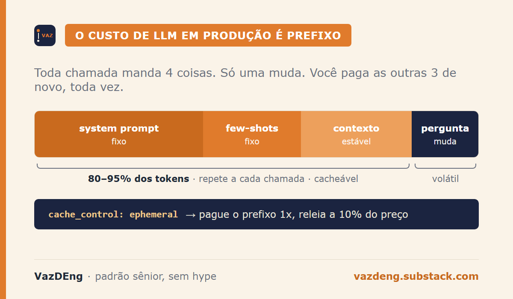
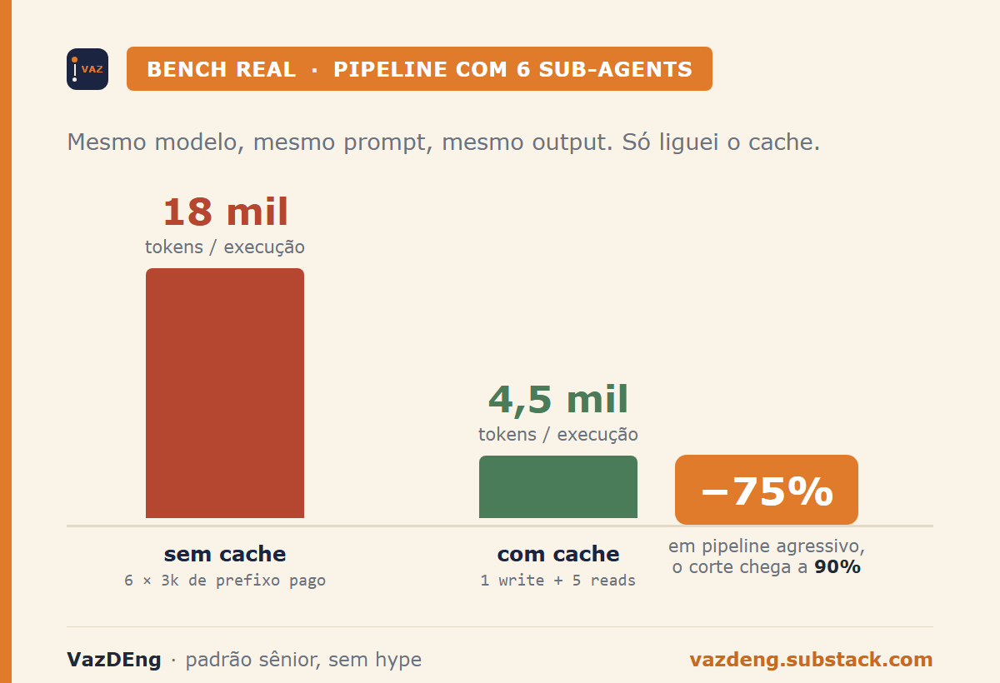
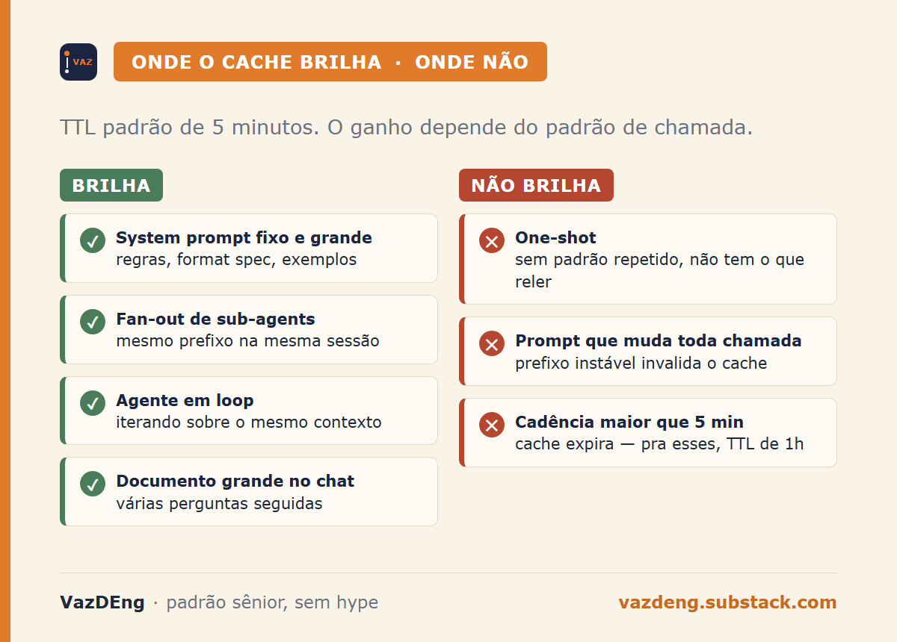

18 mil tokens. Era o custo de cada execução do meu pipeline de notícias com 6 sub-agents paralelos. Depois de uma linha de código, virou 4 mil e quinhentos. Sem mudar o modelo. Sem mudar o prompt. Sem mudar o output. Só liguei o cache.

A feature existe na API Anthropic há mais de um ano. A maioria dos times que usa LLM em produção ainda não ligou. É o ajuste com melhor retorno por minuto de trabalho que tem hoje.

## Por que o custo de LLM em produção é prefixo

Toda chamada pra API manda 4 coisas: system prompt, few-shots, contexto e pergunta. Em pipeline de verdade, os 3 primeiros somam 80 a 95 por cento dos tokens, e repetem a cada chamada. A pergunta muda. O resto é prefixo.

Sem cache, você paga pelo prefixo inteiro toda vez. Em pipeline que roda dezenas ou centenas de vezes por hora, isso vira a conta. Em pipeline com fan-out paralelo (vários sub-agents, mesmo system prompt), vira a conta vezes o número de sub-agents.

Com cache, você paga o prefixo uma vez (cache write), e depois só o delta da nova chamada (cache read). Cache read custa cerca de 10% do preço de input normal.



## Como funciona o cache na Anthropic

Você marca um bloco do prompt com `cache_control: ephemeral`. Exemplo simplificado:

```json
"system": [
  {
    "type": "text",
    "text": "<system prompt longo e estável aqui>",
    "cache_control": {"type": "ephemeral"}
  }
]
```

TTL padrão é 5 minutos. Próxima chamada dentro desse intervalo: o prefixo cacheado é lido a 10% do preço normal. A Anthropic também oferece TTL de 1 hora como opção paga, útil pra workflows mais espaçados.

A API retorna 2 métricas que você precisa monitorar:

- `cache_creation_input_tokens`: você pagou o write.
- `cache_read_input_tokens`: você pagou só o read (90% de desconto).

Sem mexer no modelo, sem reescrever prompt. Só sinalizar o que é cacheável.

## Bench real do pipeline noticias-diarias

Skill própria que roda diário 8h BRT. Dispara 6 sub-agents paralelos via tool Agent: data-eng, IA, invest, cripto, política BR, política internacional. Cada um carrega um system prompt fixo de aproximadamente 3 mil tokens com regras de tom, formato Telegram, fontes priorizadas e estilo de síntese.

Sem cache, a conta é direta:

- 6 sub-agents × 3 mil tokens de prefixo = 18 mil tokens pagos por execução.
- Multiplicado por 1 execução por dia = 540 mil tokens por mês só de prefixo.

Com cache:

- 1 cache write inicial (3 mil tokens) + 5 cache reads (com delta de ~300 tokens cada) = ~4 mil e 500 tokens efetivos.
- Aproximadamente 75% de corte no custo de prefixo, sem perder qualidade nem mudar uma vírgula do output.

Em pipeline de produção mais agressivo (que roda dezenas de vezes por hora, com prefixos maiores), o corte chega a 90%.



## Onde brilha, onde não brilha

**Brilha:**

- System prompt fixo e grande (regras, format spec, exemplos).
- Fan-out: vários sub-agents com mesmo prefixo na mesma sessão.
- Agentes em loop iterando sobre mesmo contexto.
- Chat com documento grande anexado, com várias perguntas seguidas.

**Não brilha:**

- Chamada one-shot sem padrão repetido.
- Prompt que muda significativamente a cada chamada.
- Workflow com cadência maior que 5 minutos entre calls (cache expirou).



**Cuidados que matam o ganho se você não conhece:**

1. Cache write é mais lento que call normal. Você paga uma vez em latência, ganha em todas as seguintes. Em pipeline noturno isso não importa. Em chat interativo, importa.
2. Não cachear PII ou dado sensível sem auditar. Cache é per-account na Anthropic, mas o princípio vale.
3. TTL 5 min é janela curta. Se sua skill roda o pipeline a cada 10 minutos, o cache nunca pega. Pra esses casos, use o TTL de 1 hora.
4. Você só vê o ganho se monitora as 2 métricas. Sem dashboard, você acha que ligou e não ligou.

## Não é micro-otimização. É arquitetura.

Quem está pagando 100% do preço de cada chamada porque "não teve tempo de configurar" está acumulando dívida com a Anthropic todo mês. Em pipeline de produção com volume sério, isso vira milhares de reais por ano. Por uma linha de código.

A regra é simples: estruture o prompt em camadas. Estável primeiro (cacheável), volátil depois. Marque o estável com `cache_control: ephemeral`. Monitore `cache_creation` e `cache_read`. Pague uma vez, leia muitas.

É o ABC. E ainda tem time chamando isso de "otimização avançada".

---

**Próximo post sábado 10h:** Zero to Expert Ep 02 sobre dependências em DAG, a lei que todo orquestrador segue por baixo do nome. Sem Airflow no centro.

**Assina o VazDEng** se ainda não assina: [vazdeng.substack.com](https://vazdeng.substack.com).
