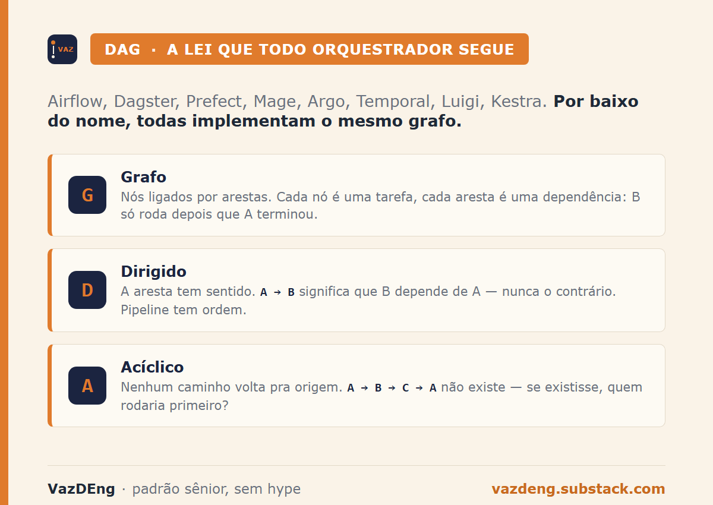
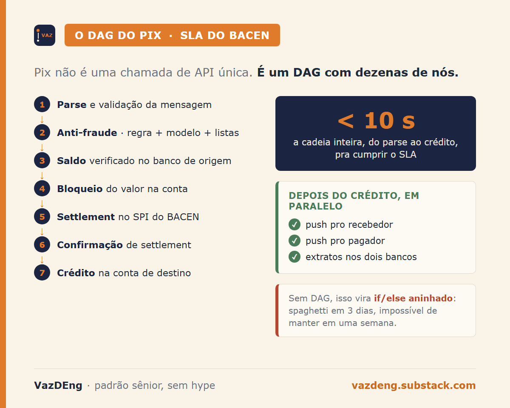
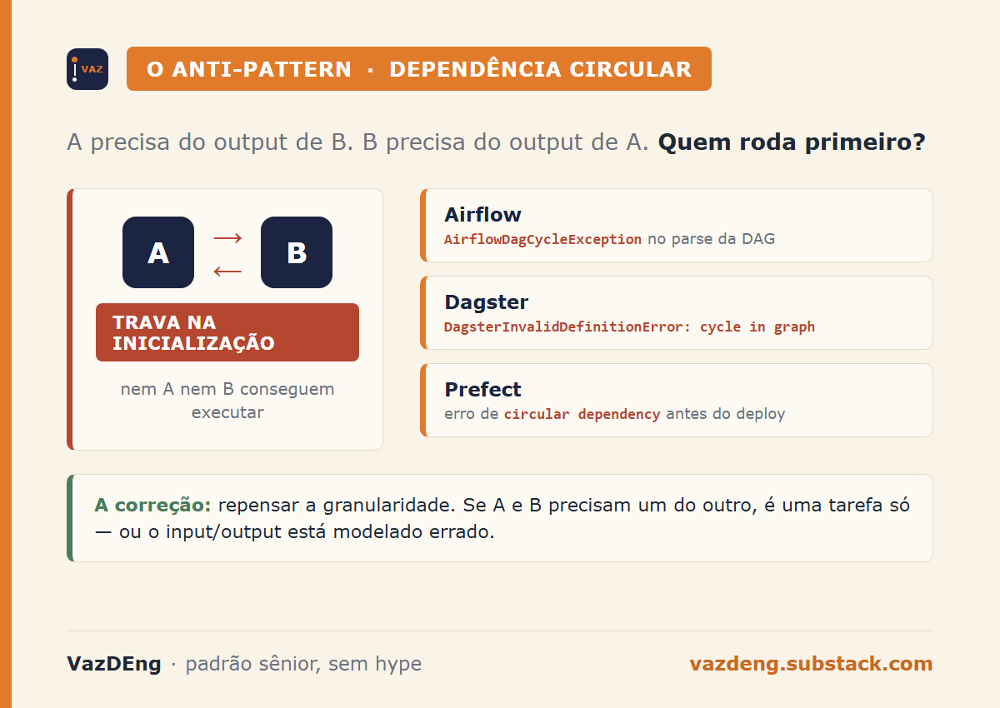

Você quer aprender orquestração de pipeline e tem 8 ferramentas pra escolher. Airflow, Dagster, Prefect, Mage, Argo, Temporal, Luigi, Kestra. Cada tutorial assume que você já entende o que vem antes da ferramenta. Eu trabalhei 2 anos com uma delas em produção, e o que me destravou não foi dominar a sintaxe. Foi entender o conceito que todas implementam por baixo do nome. É isso que eu vou cobrir hoje.

Esse é o ZTE Ep 02. Zero to Expert é a trilha que vai fazer você parar de seguir tutorial e começar a entender. Episódio 01 cobriu data flow. Hoje a vez é do DAG.

## DAG: três letras que aparecem em tudo

DAG é sigla pra Directed Acyclic Graph, ou grafo dirigido acíclico. Quebra a sigla em 3 partes:

- **Grafo:** conjunto de nós ligados por arestas. Em pipeline, cada nó é uma tarefa (carregar tabela, transformar, validar, salvar). Cada aresta é uma dependência (a tarefa B só pode rodar depois que A terminou).
- **Dirigido:** a aresta tem sentido. Se A aponta pra B, B depende de A. Não é o contrário. Isso importa porque pipeline tem ordem.
- **Acíclico:** você não pode voltar pro nó de origem seguindo arestas. Não existe A → B → C → A. Se existisse, você nunca conseguiria começar. Quem rodaria primeiro?

Visualmente: imagine uma rede de tarefas onde toda seta aponta pra frente, e nenhum caminho te leva de volta pro começo. Isso é DAG.

## Por que toda ferramenta usa DAG

Airflow, Dagster, Prefect, Mage, Argo Workflows, Temporal, Luigi, Kestra. Todas modelam pipeline como DAG. Não é coincidência. É a estrutura natural pra representar dependência de tarefa.

O algoritmo de execução é o mesmo nas 8 ferramentas: ordenação topológica do grafo, e depois execução em paralelo dos nós que não têm dependência mútua. Ordenação topológica é só uma sequência que respeita as arestas (A antes de B sempre que A aponta pra B).

A complexidade de calcular essa ordem e detectar ciclo é O(V+E) com busca em profundidade, onde V é o número de nós e E o número de arestas. Em DAG real de pipeline, isso são milissegundos. O custo computacional não está nessa parte. Está em rodar as tarefas em si.

Por isso aprender DAG antes destrava qualquer ferramenta futura. A sintaxe muda. O Python da DAG no Airflow não é o Python da DAG no Dagster. Mas o conceito é o mesmo. Depois de 2 anos mantendo DAGs de Airflow, eu leio pipeline de qualquer orquestrador sem ter rodado a ferramenta uma vez. O grafo embaixo é sempre o mesmo.

## O exemplo BR: o DAG do Pix

Pix não é uma chamada de API única. É um DAG com dezenas de nós que precisa rodar em menos de 10 segundos pra cumprir o SLA do BACEN.

A cadeia simplificada de um Pix:

1. Pre-processamento da mensagem (parse, validação de formato).
2. Validação anti-fraude (regra + modelo de risco + verificação de listas de bloqueio).
3. Verificação de saldo no banco de origem.
4. Bloqueio do valor na conta de origem.
5. Settlement no SPI (sistema de pagamentos instantâneos do BACEN).
6. Confirmação de settlement.
7. Crédito na conta de destino.
8. Notificação push pro recebedor.
9. Notificação push pro pagador.
10. Atualização de extratos em ambos os bancos.

Cada nó depende dos anteriores em ordem específica. Anti-fraude depende do parse. Settlement depende do bloqueio. Notificação depende do crédito. Nenhum desses passos pode rodar antes do anterior. E vários podem rodar em paralelo (notificação push e atualização de extrato podem ser simultâneas).

Toda essa cadeia é modelada como DAG. Se você tirasse isso e tentasse fazer com if/else aninhado, viraria spaghetti em 3 dias e impossível de manter em uma semana.

## Quando o DAG quebra: o anti-pattern circular

Dependência circular é o erro mais comum de quem está aprendendo. A tarefa A precisa do output de B, B precisa do output de A. Você não consegue executar nem A nem B. Pipeline trava na inicialização.

A boa notícia é que toda ferramenta detecta isso antes de rodar:

- **Airflow:** levanta `AirflowDagCycleException` no momento do parse da DAG.
- **Dagster:** levanta `DagsterInvalidDefinitionError: cycle in graph` ao carregar a definição.
- **Prefect:** valida o flow e dá erro de circular dependency antes do primeiro deploy.

A má notícia é que quem não entende o conceito vê o erro e não sabe o que fazer. Reescreve a DAG na tentativa e erro, achando que é bug da ferramenta. Não é. É o algoritmo te avisando que o que você definiu é impossível de executar.

A correção quase sempre é repensar a granularidade da tarefa. Se A e B precisam um do outro, na verdade é uma só tarefa, ou você está modelando errado o que é input e o que é output.

## Aprender DAG é destravar qualquer orquestrador

Entender DAG é destravar qualquer ferramenta de orquestração presente e futura. Você troca Airflow por Dagster sem trauma. Você lê código de pipeline alheio e entende. Você desenha o pipeline no papel antes de escolher tecnologia.

O contrário também é verdade. Quem só sabe a sintaxe da ferramenta fica refém. Quando a ferramenta muda (e elas mudam todo ano), tem que aprender tudo de novo. Quem entendeu o conceito só ajusta a sintaxe.

É o critério que eu uso pra estudar qualquer coisa nova nessa área: conceito primeiro, ferramenta depois. Zero to Expert não é sobre saber muita ferramenta. É sobre saber os conceitos que ferramenta nenhuma ensina.

---

**Próximo post hoje às 14h:** IA Foundations 02 sobre modelo vs harness. Por que confundir os dois custa dinheiro e segurança.

**Assina o VazDEng** se ainda não assina: [vazdeng.substack.com](https://vazdeng.substack.com).
