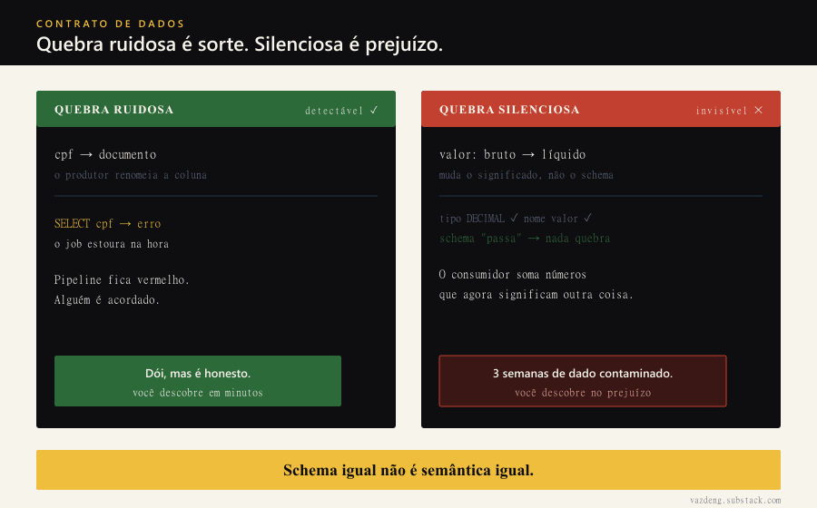

There is a type of incident I learned to fear more than a pipeline going down: the pipeline that does NOT go down. Green job, no alerts, dashboard refreshed. And the numbers wrong for three weeks.

The script is always the same. A producer team decides to improve the modeling. The `cpf` column becomes `documento` (makes sense, now it accepts CNPJ too). Or the `valor` column stops being gross and becomes net, with the payment provider fee already deducted. A defensible change, made by competent people. The change is not the problem. The problem is that nobody on the other side of the boundary was told.

I saw this pattern repeat in payments, in marketing, in analytics. The root cause is always the same implicit architectural decision: the boundary between producer and consumer is "whatever is in the table today". There is no agreement. There is hope.

## What goes wrong: a noisy break is luck, a silent break is damage

Renaming `cpf` to `documento` has a hidden upside: the consumer breaks LOUD. The `SELECT cpf` blows up, the job turns red, someone gets woken up. Painful, but honest.

The case of gross `valor` becoming net is the real nightmare. The type is still `DECIMAL(18,2)`, the name is still `valor`, the schema "passes". Nothing breaks. The pipeline happily sums numbers that now mean something else. In payments that becomes a wrong reconciliation. In analytics it becomes a product decision made on top of phantom revenue. You only find out when someone compares against the official source, and by then it is weeks of contaminated data.

The lesson I carry: same schema is not same semantics. Validating type and nullability catches the noisy case and lets the expensive one through.

## The decision: a versioned contract with SemVer, not DDL in Confluence

The fix is not more Slack ("give a heads-up before changing"). Human heads-up is the thing that fails under deadline pressure. The fix is turning the boundary into a versioned artifact, validated in CI. That is what the literature calls a data contract: Andrew Jones, first data engineer at GoCardless (a fintech), wrote the manual for this in "Driving Data Quality with Data Contracts", and Chad Sanderson popularized the practice from his own operation.

What I defend as the minimum viable contract:

- **schema** with types, nulls and a description for each column
- **semantics**: what `valor` means in the domain (BRL? net or gross? fee included?). This is exactly the field that would have prevented the nightmare above
- **owner**: team and person, not "the table"
- **freshness and completeness**: latency and expected volume range (for example, in the order of 1 to 5 million rows/day, an illustrative value, with an alarm outside the range)
- **legal_basis** per column: the LGPD legal basis for that data (`cpf` is PII, needs Art. 7 attached), plus retention (in fintech, BACEN retention periods that can reach years)
- **version** in SemVer, with a breaking change policy

SemVer applied to schema is the heart of the thing. PATCH adds a nullable column, nobody breaks. MINOR refines granularity in a compatible way. MAJOR is what hurts: removing a column, renaming a public column, changing a type, or changing the semantics of `valor`. MAJOR is not a commit, it is a process: advance notice (in the order of 60 days, an example, not a universal rule), dual-write of both versions in parallel, and an announced deprecation. The validator runs on the producer's PR and blocks the merge if the changelog does not justify the version bump. The boundary stops being trust and becomes CI.

## When you do NOT need it: a contract is a trust boundary, not universal bureaucracy

Do not go contractualizing everything. A formal contract has maintenance cost, and a contract nobody maintains becomes a fiction worse than its absence.

I do not write a formal contract when the same team owns both the producer AND the consumer, the data has low criticality, and the change is an internal refactor in the same PR. There, the "contract" is the code review and the integration test, and that is fine. The signal to formalize is the organizational boundary: the moment when the person changing the schema is not the same person feeling the break. That is where human heads-up fails and the versioned artifact pays off.

## Conclusion

A pipeline without a contract is not simpler. It is a pipeline with an implicit, unwritten contract that nobody can validate and everybody can break without knowing. The ODCS (Open Data Contract Standard, today v3.1.0 under the Linux Foundation in the Bitol project) exists precisely so you do not invent the format from scratch. Versioning the boundary is cheaper than reconciling three weeks of net revenue summed as if it were gross. I already paid the bill the wrong way. I recommend the other one.
