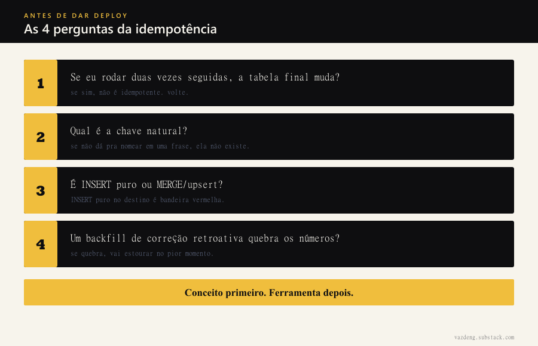

No Ep 01 a gente falou de *data flow* (o conceito antes de qualquer ferramenta), no Ep 02 de dependências em DAG (a ordem em que as coisas precisam rodar). Hoje fecho o tripé com a propriedade que separa um pipeline confiável de uma bomba-relógio: **idempotência**.

## O susto: o número que dobrou

Vou começar com um susto real, porque foi assim que eu aprendi. Um pipeline carregava as vendas do mês numa tabela. Apareceu uma correção retroativa (ajuste regulatório, dessas que no Brasil acontecem direto) e a gente precisou reprocessar o mês inteiro. Rodei o backfill. Abri o dashboard. **O faturamento tinha dobrado.**

Ninguém vendeu nada a mais. O pipeline só rodou duas vezes. E rodar duas vezes mudou o resultado. Esse é exatamente o problema que a idempotência resolve.

## O conceito, sem ferramenta nenhuma

Idempotência é uma palavra feia pra uma ideia simples:

> Rodar a mesma operação uma vez ou cinco vezes tem que dar o mesmo resultado.

Apertar o botão do elevador dez vezes não faz o elevador vir dez vezes. Ele vem uma. O botão é idempotente. Um pipeline idempotente é a mesma coisa: você roda, roda de novo por causa de uma falha de rede, roda mais uma vez num backfill, e a tabela final fica idêntica. Re-run é inofensivo por design.

E por que isso importa tanto? Porque em sistema distribuído **rodar duas vezes não é exceção, é rotina**. Job que cai no meio e o orquestrador tenta de novo. Streaming que reprocessa um evento depois de um *checkpoint recovery*. Correção retroativa que te obriga a refazer o passado. Se cada re-run muda o número, você não tem um pipeline, tem uma roleta.

## Onde nasce o problema: o INSERT puro

O vilão quase sempre é o mesmo. Um `INSERT` que só sabe *adicionar* linha:

```sql
INSERT INTO vendas_mes
SELECT * FROM staging_vendas;
```

Primeira execução: 100 mil linhas. Reprocessou: mais 100 mil. Agora são 200 mil, metade duplicada, e o `SUM(valor)` dobrou. O INSERT não tem memória do que já está lá. Ele só empilha. Foi exatamente isso que dobrou meu faturamento.

## A solução conceitual: chave natural + MERGE

A virada de chave tem duas partes, e a ordem importa.

**1. Definir a chave natural.** É o identificador do negócio que diz "esta linha é *esta* venda, não outra". Pode ser `pedido_id`, ou a combinação `cliente_id + data + produto`. Sem essa chave, o sistema não tem como saber se uma linha que chegou já existe. Eu vejo gente pular essa etapa e ir direto pra ferramenta. Não pule: a chave natural é a fundação, o MERGE é só o pedreiro.

**2. Trocar INSERT puro por MERGE (upsert).** O MERGE compara cada linha que chega com o que já existe, usando a chave: se já existe, **atualiza**; se não existe, **insere**. "Upsert" é a contração de update + insert.

```sql
MERGE INTO vendas_mes AS alvo
USING staging_vendas AS origem
  ON alvo.pedido_id = origem.pedido_id
WHEN MATCHED THEN UPDATE SET *
WHEN NOT MATCHED THEN INSERT *;
```

Agora rode esse MERGE dez vezes. Na segunda rodada, cada `pedido_id` já existe, então cada linha *atualiza pra ela mesma* com o mesmo valor. Zero duplicata. O número fica firme. Isso é o que a indústria chama de *exactly-once* no destino: a fila de eventos pode entregar a mesma venda duas vezes (*at-least-once* é o normal), mas o upsert-por-chave no destino absorve a repetição sem reclamar.

Um detalhe que aprendi na marra: **MERGE sem a chave certa não salva ninguém**. Se a condição do `ON` casar com várias linhas, ou se a chave não for de fato única, o MERGE volta a duplicar. A chave natural confiável é o que faz a mágica acontecer, não o comando.


## Checklist mental antes de subir qualquer pipeline

Eu rodo essas quatro perguntas na cabeça antes de dar deploy:

- **Se eu rodar isso duas vezes seguidas, a tabela final muda?** Se sim, não é idempotente. Volte.
- **Qual é a chave natural?** Se você não consegue nomear em uma frase, ela ainda não existe.
- **É INSERT puro ou MERGE/upsert?** INSERT puro em tabela de destino é bandeira vermelha.
- **Um backfill de correção retroativa quebra os números?** Se quebra, o problema vai aparecer no pior momento possível, com o dado já errado em produção.



Idempotência não é firula de engenheiro perfeccionista. É o que deixa você dormir tranquila sabendo que reprocessar o passado não vai dobrar o presente. Conceito primeiro, ferramenta depois: a chave natural pensa, o MERGE executa.

No Ep 04 a gente sobe um degrau e fala de *backfill* de verdade, agora que você já tem a rede de segurança pra rodar o passado sem medo.
