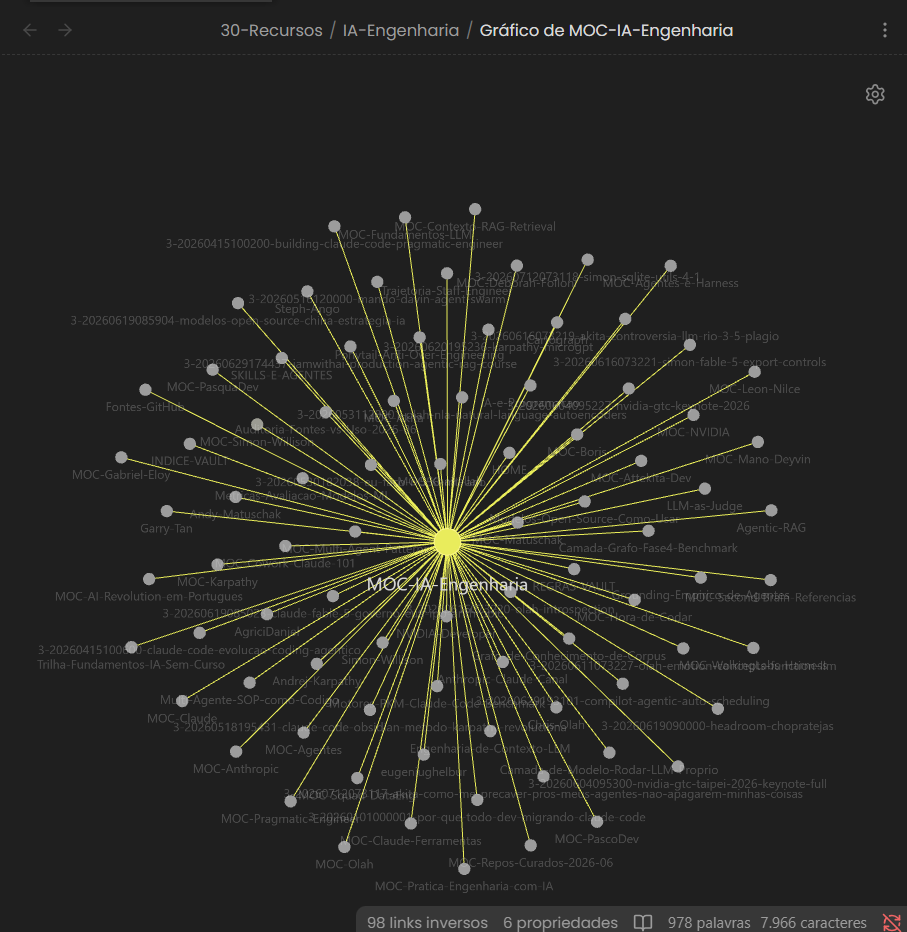
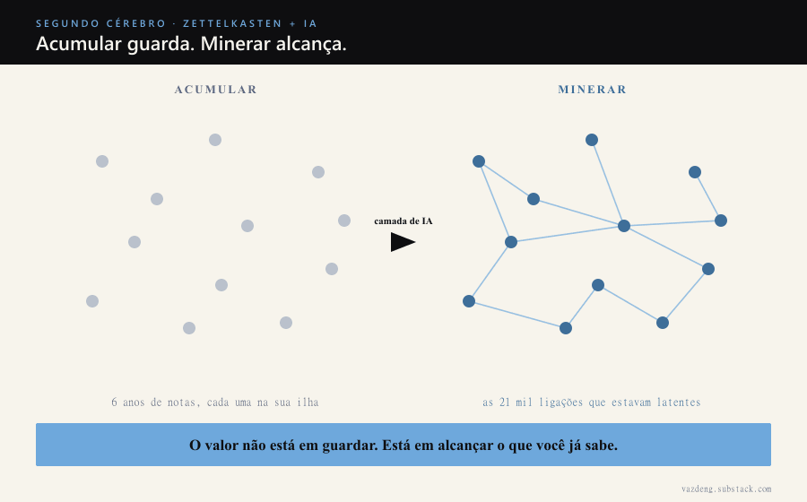

---
title: "6 anos de Zettelkasten: o dia que a IA me mostrou o que eu já sabia"
subtitle: "Eu escrevi as notas. A IA achou as ligações entre memórias que eu tinha esquecido."
publish_date: 2026-07-21
track: SC
num: "001"
slug: segundo-cerebro-llm-escreve-voce-cura
tags:
  - segundo-cerebro
  - zettelkasten
  - obsidian
  - claude-code
  - knowledge-management
---

Faz seis anos que eu construo meu segundo cérebro no Obsidian, seguindo Zettelkasten.

Nota por nota, no meu ritmo. Eu li, eu resumi, eu conectei. Não é um arquivo, é onde ficam as minhas memórias de conhecimento: seis anos do que eu li, estudei e pensei, cada ideia numa nota atômica ligada às outras.

Hoje são quase 2.700 notas, 1.392 fichamentos, 77 mapas de conteúdo e quase 21 mil conexões entre elas. Eu escrevi tudo isso. E mesmo assim não consigo lembrar de tudo ao mesmo tempo.

Não é defeito meu. É o limite de qualquer memória grande.

## O que Zettelkasten resolve, e o que ele não resolve

Zettelkasten é lindo justamente por isso: cada nota é uma memória atômica, pequena, ligada às vizinhas. Foi por isso que eu escolhi o método. Ele guarda o conhecimento do jeito que a cabeça funciona, por associação, não por pasta.

Mas existe um limite humano. Quando você acumula seis anos, a base sabe mais do que a sua cabeça alcança num dado momento. Você escreveu sobre um tema hoje, sobre outro três meses atrás, e as duas memórias raramente se encontram sozinhas. Não é que elas sumiram. É que você não consegue segurar todas as conexões ao mesmo tempo.

Guardar a memória, Zettelkasten faz muito bem. Alcançar tudo de uma vez, aí a cabeça não dá conta sozinha.

## O que a IA mudou

A IA não veio escrever as minhas notas. Veio me ajudar a lembrar delas.

O Karpathy, co-fundador da OpenAI, popularizou em 2026 um padrão onde o LLM organiza uma base de conhecimento a partir das fontes que você guarda. Eu peguei a parte de mineração e coloquei em cima do Zettelkasten que eu já tinha.

Na prática: quando entra uma memória nova, uma transcrição, um artigo, um paper, um agente lê, escreve o fichamento e encontra sozinho as notas antigas sobre o mesmo assunto, criando as ligações. Depois um segundo agente varre o vault inteiro atrás de conexões que eu nunca tinha feito à mão, e propõe pontes entre memórias que nunca tinham se encontrado.

O resultado são aquelas quase 21 mil conexões. Eu escrevi as notas ao longo de seis anos. A IA tornou visível a estrutura que já estava latente ali dentro, esperando alguém com paciência infinita pra cruzar tudo com tudo.

E aí eu consigo fazer a pergunta que antes era impossível: "o que eu já sei sobre X, considerando tudo que eu já estudei?". A resposta não vem da memória de um chatbot genérico. Vem de seis anos de conhecimento meu.

## O compounding que só aparece quando você conecta

Tem uma verdade sobre memória de conhecimento que quase ninguém conta: o valor não é linear, é composto.

A primeira nota de um tema vale pouco sozinha. A milésima vale muito, porque conversa com outras novecentas. Cada memória nova refina o que já estava lá. É juro composto de conhecimento.

Mas juro composto que você não consegue acessar fica parado. Por seis anos o meu ia acumulando. Conseguir enxergar as conexões todas é o que faz o acúmulo virar alavanca: em decisão, em conteúdo, e sim, em renda.

## Duas coisas continuam sendo minhas

E são justamente as que importam.

A curadoria: o que entra. Nenhum agente decide que uma fonte vira memória minha. Esse critério é meu, e é onde mora o valor.

E o pensamento. A nota que eu escrevo pensando, a reflexão, a ideia meio formada. A IA me ajuda a lembrar e a conectar o que eu já pensei. Pensar, continuo eu.

## O que o grafo mostra

Os aglomerados densos lá em cima, as ligações que se cruzam no meio entre os domínios, ficaram visíveis nos últimos meses, quando a camada de mineração entrou e acendeu o que já estava lá. A estrutura sempre foi minha. A IA só me deixou enxergar ela inteira.

Se você tem um segundo cérebro grande, a pergunta não é qual plugin instalar. É se você consegue alcançar tudo que já guardou. Zettelkasten me deu a memória. A IA me deu como acessá-la inteira.
