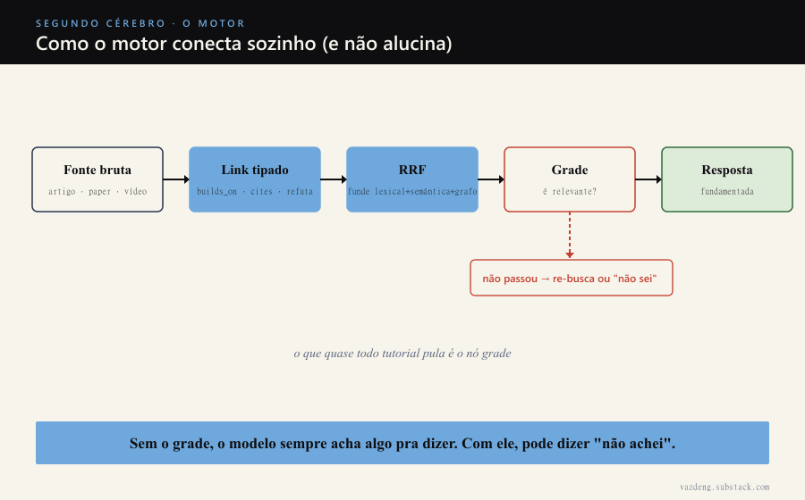
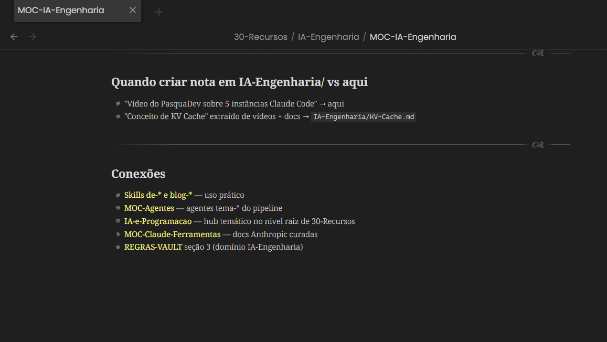

On Tuesday I told you that AI became the jackhammer of my second brain. Today I open up the jackhammer.

Most people plug a vector database on top of their notes, call it RAG and assume the problem is solved. The system then answers with all the confidence in the world about the wrong note. The engine I built has three pieces that almost every tutorial skips, and it is the combination of them that makes the mining work instead of hallucinate.

## 1. Typed links, not loose wikilinks

A wikilink says two notes touch. It does not say how.

My analyzer does not just propose "connect A and B". It proposes **typed and weighted** connections: `builds_on`, `cites`, `contradicts`, `authored_by`. There were 111 applied in the AI engineering domain alone.

The difference looks subtle and it is not. A retrieval system that knows "A refutes B" cannot treat that the same as "A cites B". When you ask something and the system pulls context, the type of the edge changes the weight of the information. A note that contradicts your thesis is worth gold. A note that only mentions it in passing, not so much. A raw wikilink flattens everything onto the same plane.

## 2. RRF: never trust a single ranking

Reciprocal Rank Fusion. Ugly name, simple idea.

You do not have one way to search, you have several. Lexical search finds the exact term. Semantic search finds the relative that uses different words. Graph search finds the connected neighbor. Each one returns a ranking, and each one fails in a different way.

RRF fuses the rankings. A note that shows up well positioned in three different searches beats the note that came first in a single one, by luck. It is the opposite of betting all your chips on one retrieval method and praying. You combine the points of view and let the consensus rise.

## 3. The grade node: what prevents confident answers built on garbage

This is the piece nobody adds, and it is the most important one.

There is a pattern I took from a paper called COMPILOT: the LLM proposes, a deterministic engine verifies and measures, and the result feeds back into the loop. Applied to retrieval, that becomes a **grade node**: before letting the model answer, a step reads the retrieved context and asks "is this relevant to the question that was asked?".

If the context does not pass, the system searches again or admits it does not know. It does not push a pretty answer built on top of the wrong note.

This is exactly where the difference lives between a demo RAG and a system you trust day to day. Without the grade, the model always finds something to say. With the grade, it has permission to say "I did not find it". A second brain that lies with confidence is worse than having no second brain at all.

## When you need none of this

I will be honest, because that matters more than the hype.

If your vault has a few hundred notes, you do not need this engine. `grep` plus the model's context solves it. Searching by hand solves it. Building typed links, rank fusion and a grading node for a small base is engineering on top of a problem you do not have.

The engine only starts to pay off when the volume passes the point where you can no longer find things by hand, and when the base crosses enough different domains that naive search brings back garbage. Getting there took 17 issues coded and tested, merged into main. It is not a weekend script. It is the difference between a toy and a tool.

## What comes on Saturday

The engine is the jackhammer. It mines.

On Saturday I show what it found when it crossed the five domains of my second brain at once: 130 bridges between areas I would never have connected by hand. The asset, in the end, is not the notes. It is the edges.
