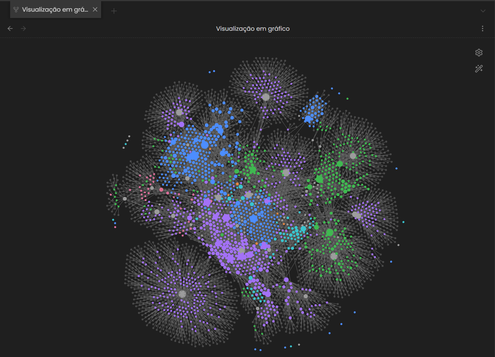
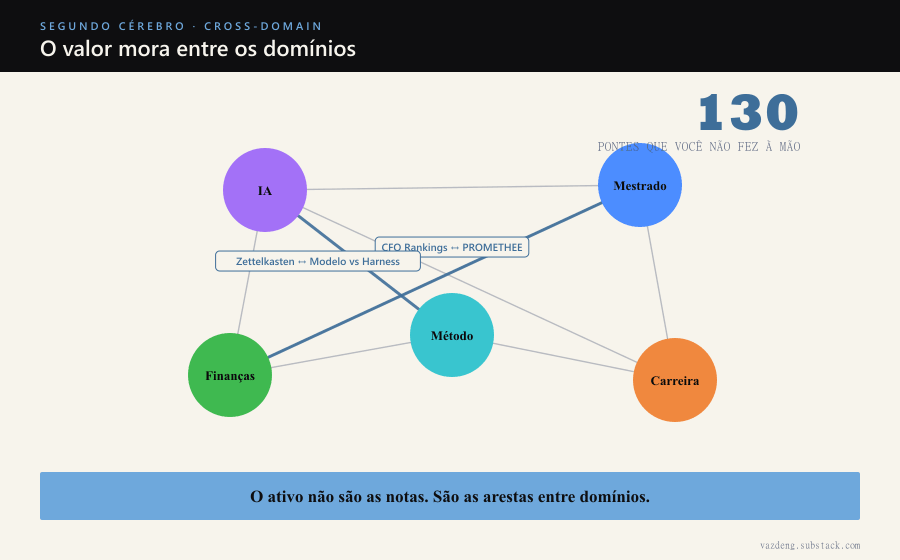

I spent six years writing notes across five separate domains. Finance on one side. AI engineering on another. Master's, method, career, each in its own box.

I never crossed them consciously. Anyone with an ADHD brain and a large second brain knows the feeling: you read about one thing today, about another thing three months later, and the two never meet in your memory. They stay on islands.

Then the engine crossed all five domains at once. It found 130 bridges.

## What a cross-domain bridge is

It is a connection between two notes that live in different areas of my life and make sense together, but that I never linked because I never thought about both at the same time.

Three real examples, out of the 130:

- **My investment system** ranks assets by a composite criterion. **The multi-criteria decision theory I study in my master's** (my advisor's method) is literally the formalism behind that ranking. Six years, and I had never connected my homegrown quant to the math I study for my thesis.
- **The second brain method I use** and **Karpathy's knowledge base pattern** are the same idea seen from two angles, one from the productivity side, one from the AI engineering side. They lived in different domains of the vault.
- **A note on Zettelkasten applied to agents** and **a note on the difference between model and harness** hold each other up. One became a foundation of the other without me ever noticing.

I would never make any of these by hand. Not because they are hard, but because they require remembering two distant notes at the same time, and nobody has that memory.

## Why the value lives in the edges

We think of a second brain as a pile of notes. As if the value were the collection.

It is not. The collection is raw material. The value shows up when a finance idea solves an AI problem, when a method concept explains a career block. That is cross-pollination, and it is the hardest thing to force. You do not plan to have an idea like that. It happens when two worlds touch.

A second brain that only stacks notes inside each domain never produces that. You end up with five parallel libraries that never talk to each other. The 130 bridges are exactly the conversations that were missing, latent in there, waiting for someone with infinite patience to cross everything with everything.

## How this does not turn into noise

A machine that proposes connections without a filter becomes pollution. The point is not to accept all 130.

There were 130 proposals. Six were already linked and the engine discarded them. Zero invalid ones slipped through as valid. And each proposal arrives with the two nodes, the link type and the justification, for me to approve or reject. The machine mines, I judge. Once again, it is the same principle as the whole week: the heavy lifting is the machine's, the criterion is mine.

And, as always, the honest warning: a small base does not have the cross-domain mass to make this worth it. If you have a single domain, or just a few notes, there is no hidden bridge to find. This is a tool for people who have already accumulated enough to have forgotten half of it.

## The end of the week, and the start of the argument

That was the week. Tuesday, why mining beats accumulating. Thursday, the engine that mines. Today, what it found.

My second brain is not a pretty archive I keep. It is a machine that turns six years of reading into connection, and connection into decision, into content, and yes, into income. The part that stays mine, the curation and the judgment, is the part nobody can copy.

If you have a vault that turned into a graveyard, maybe the problem was never the number of notes. Maybe it is that they never met.
