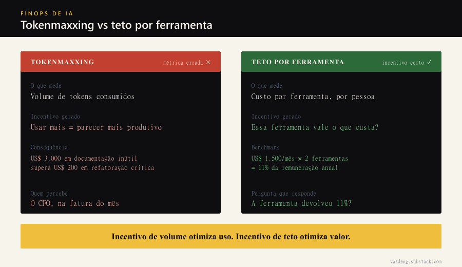
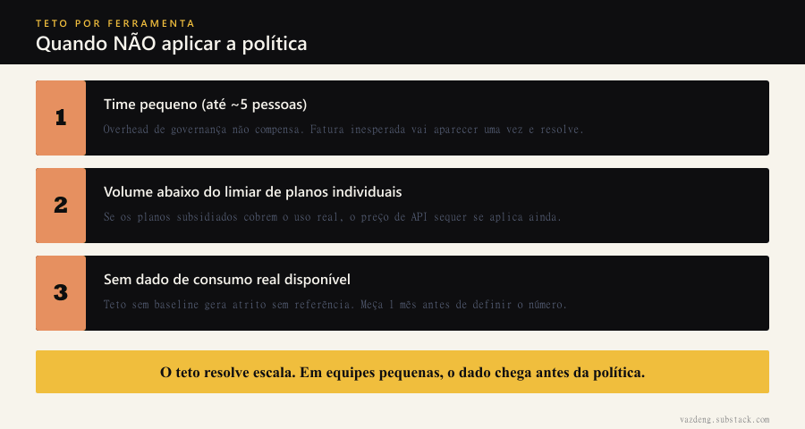

Vi esse padrão acontecer mais de uma vez: orçamento de IA planejado para o ano inteiro, esgotado em quatro meses.

Isso não foi incompetência de planejamento. Foi um problema de timing: o plano foi feito em 2025, antes de qualquer empresa ter medido o quanto coding agents consomem de token quando alguém os usa de verdade, o dia inteiro, em tarefas reais. Quando o consumo real chegou, o número era outro.

A Uber passou por isso em 2026 e respondeu com uma política que Simon Willison analisou no seu blog em junho daquele ano: teto fixo de US$ 1.500 por mês por ferramenta de coding agent, por funcionário. Não por equipe, por pessoa. Não por categoria, por ferramenta.

O número parece arbitrário até você ver de onde ele veio.

## O tokenmaxxing é o problema

Antes do teto, a métrica comum é leaderboard. Times competem por quem usa mais tokens, quem aprova mais requisições de acesso, quem tem o maior consumo no billing. Parece engajamento. É a métrica errada.

Tokenmaxxing incentiva uso, não valor entregue. Um engenheiro que gasta US$ 3.000 em tokens gerando documentação que ninguém lê supera no ranking um engenheiro que gasta US$ 200 e entrega uma refatoração crítica. O leaderboard não distingue. O CFO distingue, mas só quando chega a fatura.

Teto por ferramenta força a pergunta certa: essa ferramenta específica vale o que custa para mim?

## De onde vem o 11%

Simon Willison fez o cálculo que transforma a política de US$ 1.500 num benchmark mais geral.

A Uber permite duas ferramentas de coding agent por engenheiro. Dois tetos de US$ 1.500 dão US$ 3.000 por mês, ou US$ 36.000 por ano. A remuneração mediana de um engenheiro de software da Uber nos EUA, segundo o Levels.fyi citado por Willison, fica em torno de US$ 330.000 por ano. A conta é direta: o teto de gasto com IA equivale a cerca de 11% do custo total de um engenheiro.

Esse percentual é o que o mercado está disposto a pagar em ferramenta de IA por pessoa. Se a ferramenta não devolver pelo menos 11% de produtividade, ela não paga o próprio custo.

Para uma equipe de dez engenheiros, o raciocínio escala igual. O orçamento de IA deixa de ser linha de item aleatória e vira proporção do custo de pessoal. Essa é uma conversa que qualquer gestor de orçamento entende sem precisar de contexto técnico.

## O que muda na prática

Há três ajustes que o benchmark do 11% exige.

Primeiro, projetar custo com o preço certo. Um engenheiro que assina plano individual de Claude ou Cursor paga em torno de US$ 100 por mês por causa do subsídio dos fornecedores para contas pessoais. A empresa que contrata via API paga o preço cheio, em torno de US$ 1.000 a US$ 1.500 por engenheiro ativo por mês. Projeção de custo corporativo feita com base em plano pessoal erra por um fator de dez a quinze antes de começar.

Segundo, o teto é por ferramenta, não por pessoa. Uma ferramenta que o engenheiro não usa não conta no teto. Isso incentiva adoção real e medida, não licença acumulada que ninguém usa.

Terceiro, o contraste entre as duas políticas é de design de incentivo. Leaderboard de tokenmaxxing otimiza a métrica errada, porque gamificar consumo de IA incentiva volume, não valor. O teto por ferramenta move o incentivo para valor entregue por custo assumido.

Quando NÃO aplicar: a política é para escala. Para um time de duas ou três pessoas, o overhead de governança não compensa. Para um time de vinte, a fatura sem teto é indefensável para qualquer controller. O ponto de inflexão está em algum lugar entre esses dois extremos, e cada empresa chega nele na hora da primeira surpresa na fatura.

## A pergunta que o benchmark responde

Antes de propor orçamento de coding agent para qualquer gestor, uso uma conta que precisa fechar: a ferramenta devolve mais do que 11% de produtividade por engenheiro?

Se a resposta não é verificável com dado, a aprovação vai depender de fé. Com o benchmark, ela depende de uma hipótese falsificável: mede-se o antes, mede-se o depois, compara-se com o custo.

Esse é o valor real do número que a Uber criou ao estourar o orçamento. Não foi só uma política de corte. Foi um benchmark que qualquer empresa pode usar para justificar, ou rejeitar, o próximo ciclo de investimento em IA para engenheiros, com a régua certa.
