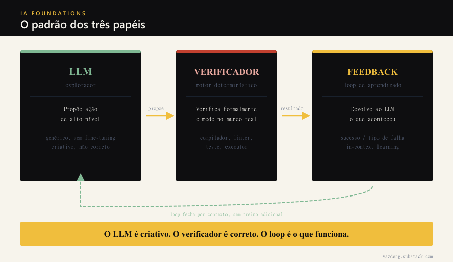

Vi esse cenário se repetir: o agente gera o código, os testes passam, o PR fecha. Dois dias depois, com dados de produção que o teste não cobria, o comportamento era diferente.

Não foi bug de código. Foi bug de arquitetura do agente. O LLM escreveu o artefato final e o verificador que existia era comparação de output: o resultado bate com o exemplo? Aprovado. O exemplo não era representativo.

Um paper publicado no IEEE PACT 2025 formalizou o que está errado nessa arquitetura, com número.

## O experimento que resolve a questão

O COMPILOT (Merouani, Kara Bernou, Baghdadi, NYU Abu Dhabi) construiu um sistema de otimização de código com LLM e testou duas versões contra a mesma base de 150 programas científicos.

Na versão 1, o LLM propõe transformações de alto nível ("ladrilha esses loops, paraleliza aquele"). Um compilador verifica formalmente se a transformação preserva o resultado do programa, aplica, roda na máquina e mede o tempo real. O resultado vai de volta para o LLM, que tenta a próxima. O loop fecha com medição empírica, não com intuição.

Na versão 2, o LLM escreve o código otimizado diretamente. A corretude é checada comparando o output com o original num conjunto de exemplos.

Os resultados são diretos. Tirar o loop de feedback derrubou o desempenho entre 23% e 40% (experimento RQ6). A versão onde o LLM escreve o código final diretamente ficou 14 a 16% pior no ganho médio, consumiu 5,3 vezes mais tokens e, detalhe que importa: 17,6% dos resultados que passaram na validação por comparação de output estavam errados quando testados com entradas novas (experimento RQ7).

Erros que pareciam aprovados. Nenhum sinal de falha no verificador.

## O que estava errado no verificador

Comparar output de exemplo é fraco como verificador. Funciona quando o exemplo cobre todos os casos relevantes. Quando não cobre, aprova código que parece certo e não é.

Um compilador que verifica dependências formalmente não tem esse problema. Ele decide matematicamente se a transformação muda ou não o resultado do programa, independente do exemplo. A corretude é garantia, não amostra.

Essa é a distinção central do paper: não é sobre qual LLM escolher. É sobre o que fecha o loop. O modelo genérico com verificador forte superou modelos especializados em código no mesmo benchmark, porque o modelo especializado em código não é melhor em propor estratégia de alto nível. É bom em gerar código. Gerar código é exatamente o que não deve ser a responsabilidade do LLM nessa arquitetura.

## O padrão que generaliza

O esqueleto do COMPILOT é genérico. LLM propõe ação de alto nível, motor determinístico verifica formalmente e mede no mundo real, feedback empírico fecha o loop. Sem fine-tuning especial.

Implementações práticas seguem a mesma lógica. Um agente que gera SQL para transformação de dados: o LLM propõe a query, um runner executa e valida o schema do resultado, o output volta como feedback. Um agente de refatoração: o LLM sugere a mudança, o compilador ou o linter confirma legalidade, os testes medem cobertura. Um agente de análise de segurança: o LLM propõe as hipóteses de vulnerabilidade, ferramentas estáticas verificam e filtram o que é real.

O LLM aprende dentro do loop, por contexto, sem treino adicional. O paper chama isso de in-context learning: o diálogo é a memória.

## Quando NÃO usar

Tarefas de único turno sem consequência irreversível. Se o agente vai responder uma pergunta de documentação que um humano vai revisar antes de qualquer ação, o overhead do loop de feedback não compensa. O padrão é para tarefas onde o erro tem custo, o verificador existe e a tarefa se repete.

O sinal de que você precisa do loop (e que uso como critério de design): quando o agente gera artefatos que vão diretamente para um ambiente real sem revisão humana, e quando a comparação de output não cobre o espaço de entradas possíveis.

## O que isso muda ao construir um agente

Aprendi que a primeira pergunta ao projetar um agente não é qual LLM usar. É: qual é o motor de verdade?

Se não há verificador determinístico que valide o artefato antes de chegar ao ambiente real, o que você tem é um gerador probabilístico sem freio. O LLM vai gerar algo plausível. Plausível não é correto, e a diferença entre os dois não aparece no exemplo que você testou.

O COMPILOT superou o melhor otimizador especializado (Pluto) porque mediu o tempo real em vez de otimizar uma fórmula de custo. O Pluto otimizava um proxy. O COMPILOT media o dado. Essa é a diferença entre um agente que funciona e um agente que parece funcionar.
